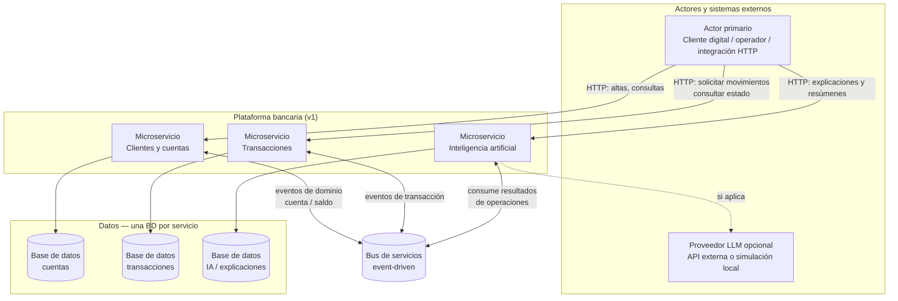
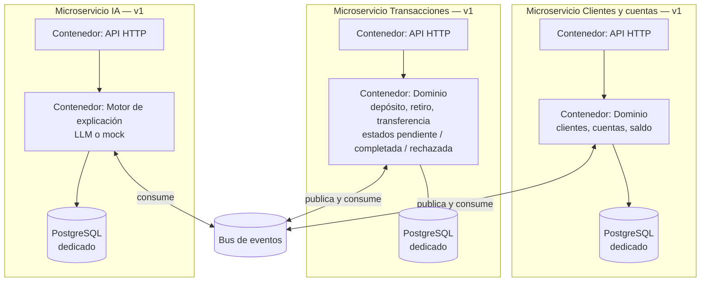
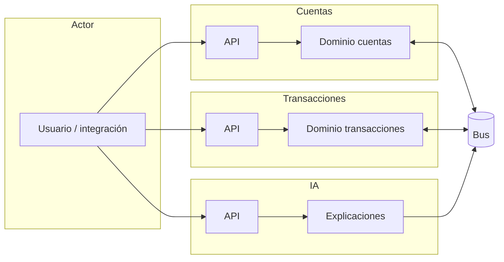

# Arquitectura C4 — primera versión (baseline de requerimientos)

Este documento fija la **primera versión** del mapa arquitectónico de la plataforma bancaria, tal como se deriva del [enunciado del reto](./requerimientos.md) **antes** de entrar en detalles de implementación (outbox, snapshots, DLQ, etc.). Sirve como **línea base evolutiva**: los diagramas posteriores en [04-services](../04-services/index.md) refinan estos contenedores con el código real.

**Alcance de la v1:** actores, tres microservicios autónomos, bus de eventos, tres bases de datos y el rol del LLM como capacidad auxiliar — sin pretender ser el modelo de despliegue final.

**Herramienta de diagramas:** [Mermaid](https://mermaid.live/) (`flowchart` como equivalente legible a C4 nivel contexto y contenedores).

---

## 1. Contexto del sistema — nivel C1 (v1)

En esta primera iteración se asume un **único tipo de actor externo** que interactúa por HTTP con los servicios que expongan API, y un **bus de eventos** como sistema compartido de mensajería. Las bases de datos aparecen como almacenes dedicados por servicio, acorde al requisito de **persistencia independiente**.

### Lectura evolutiva del C1 (v1)

| Elemento | Decisión en v1 | Nota para iteraciones posteriores |
|----------|----------------|-----------------------------------|
| Actor | Un solo bloque “canal HTTP” | Se puede desglosar en app móvil, BFF, backoffice |
| Bus | Caja única “event-driven” | En implementación: Kafka/Redpanda, topics nombrados, idempotencia |
| Tres MS | Límites por bounded context del enunciado | Misma separación se mantiene en el repo |
| LLM | Relación opcional desde el MS de IA | Mock por defecto; Ollama u otro proveedor como detalle técnico |

---

## 2. Contenedores — nivel C2 (v1), por microservicio

La **v1 de contenedores** describe el interior lógico de cada microservicio en términos de **exposición HTTP**, **núcleo de negocio o análisis** y **persistencia**, más el acoplamiento al bus. No lista clases NestJS ni módulos: eso corresponde a la documentación de [04-services](../04-services/).

### 2.1 Visión conjunta (tres servicios en un lienzo)

### 2.2 C2 detallado — interacción v1 entre contenedores (flujo conceptual)

En **v1** el diagrama enfatiza que **ningún microservicio sustituye al otro por HTTP** para completar una transacción de extremo a extremo: la coordinación temporal entre “solicitud” y “efecto en saldo” se delega al **bus**, tal como exige el enunciado (flujo **no síncrono** entre servicios para la ejecución del movimiento).

---

## 3. Cierre evolutivo: de la v1 de requerimientos al código

Esta **primera versión** C1/C2 es deliberadamente **estable y pobre en detalle técnico**: permite validar límites, actores y dependencias con el negocio antes de fijar patrones (outbox, snapshots, consumidores, DLQ).

| Versión documental | Dónde profundizar |
|--------------------|-------------------|
| **v1 (este documento)** | Actores, 3 MS, bus, 3 BD, rol del LLM |
| **Implementación NestJS + Kafka** | [04-services/index.md](../04-services/index.md) y un documento por servicio |

Si en el futuro se versiona de nuevo el C4 a nivel requerimientos (v2), lo natural sería añadir explícitamente los **nombres de eventos** del enunciado como contrato entre contenedores, manteniendo este archivo como **histórico de baseline** o renombrándolo con sufijo de fecha.

---

## Documentos relacionados

- [requerimientos.md](./requerimientos.md) — enunciado original
- [04-services / índice](../04-services/index.md) — C4 lógico alineado al código
- [03-event-driven](../03-event-driven/) — contratos de eventos e idempotencia

[← README de 01-requerimientos](./README.md)
