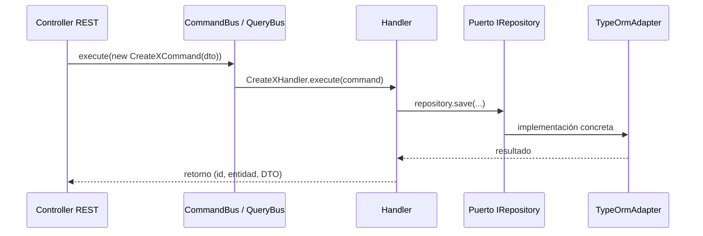

# Arquitectura hexagonal y CQRS en este proyecto

Este documento explica **cómo** se aplica el estilo hexagonal (puertos y adaptadores) y el patrón **CQRS** en el código, con referencias concretas a rutas y convenciones reales — no solo el nombre del patrón.

## Hexagonal: qué problema resuelve aquí

El dominio y la aplicación **no** deben depender de NestJS HTTP, TypeORM ni PostgreSQL concretos. Eso se traduce en:

1. **Puertos (interfaces)** definidos hacia “afuera” del dominio: “necesito persistir un `Client`”, sin saber si es TypeORM o una API mock.
2. **Adaptadores** que implementan esos puertos: repositorios TypeORM, clientes HTTP, almacenamiento de ficheros.
3. **Adaptadores de entrada** (REST) que solo traducen HTTP → comandos/consultas y devuelven DTOs de respuesta, sin mezclar reglas de negocio con decoradores de framework donde sea evitable.

En la práctica, la **orquestación y las reglas** viven en **handlers CQRS**; los controladores se mantienen delgados.

**Objetivo de refactor del equipo:** controladores **solo** reciben/devuelven datos HTTP; **un fichero por Command y uno por Query** (y sus handlers asociados en ficheros dedicados); funciones auxiliares compartidas en **utilidades** del feature o `shared`. Detalle normativo: [application-layer-conventions.md](./application-layer-conventions.md).

## Estructura típica de un módulo de feature

Ejemplo real: `src/modules/partners/` (también aplica a `invoicing`, `remission-guides`, `purchases`, etc., con pequeñas variaciones de nombres).

```
partners/
├── application/
│   ├── commands/           # Clases Command + *Handler (escrituras)
│   ├── queries/          # Clases Query + *Handler (lecturas)
│   ├── dtos/             # DTOs API / serialización
│   └── query-handlers/   # Algunos módulos separan handlers paginados aquí
├── domain/
│   ├── entities/         # Entidades de dominio (no TypeORM)
│   ├── ports/out/        # Puertos: *Repository (interfaz)
│   └── repositories/     # En otros módulos: *.repository.interface.ts
└── infrastructure/
    ├── adapters/
    │   ├── in/rest/      # Controladores HTTP
    │   └── out/persistence/  # Implementaciones TypeORM de los puertos
    └── persistence/    # En algunos módulos: entidades TypeORM + repos
```

### Convivencia de dos convenciones de “puerto”

En el repositorio aparecen **dos estilos** de definir el mismo concepto (puerto de persistencia):

| Estilo | Ubicación ejemplo | Nombre del fichero |
|--------|-------------------|--------------------|
| Puerto explícito | `partners/domain/ports/out/` | `client.repository.port.ts` → `IClientRepository` |
| Interfaz de repositorio | Otros módulos | `domain/repositories/foo.repository.interface.ts` |

Ambos cumplen el mismo rol arquitectónico: **el dominio/application depende del tipo abstracto**, no de la clase TypeORM.

### Puerto base compartido

`src/shared/domain/repository.port.ts` define `IRepository<T>` con operaciones genéricas (`save`, `findById`, `findAll`, `delete`). Muchos puertos del dominio **extienden** esta interfaz y añaden métodos específicos del agregado (por ejemplo paginación, búsquedas).

### Adaptador de salida (persistencia)

Las clases `TypeOrm*Repository` implementan el puerto e inyectan `TenantConnectionManager`: obtienen el `DataSource` del tenant y mapean entidad de dominio ↔ entidad TypeORM cuando hace falta. Ahí es donde deben vivir **filtros, joins y paginación** eficientes (QueryBuilder/SQL), no en memoria en el handler; criterios en [query-optimization.md](./query-optimization.md).

**Registro en el módulo Nest** (inyección por token de string):

```typescript
{
  provide: 'IClientRepository',
  useClass: TypeOrmClientRepository,
}
```

Los handlers usan `@Inject('IClientRepository')` para recibir la abstracción. Así se puede sustituir el adaptador en tests o en otro entorno sin tocar el handler.

### Adaptador de entrada (REST)

Los controladores bajo `infrastructure/adapters/in/rest/`:

- Validan/convierten el cuerpo de la petición con **DTOs** (`class-validator` / Swagger donde aplica).
- Construyen un **Command** o **Query** (objetos pequeños, inmutables).
- Delegan en **`CommandBus`** o **`QueryBus`** de `@nestjs/cqrs`.
- No contienen lógica de negocio pesada (listados complejos, transacciones, integraciones) — eso queda en handlers.

Ejemplo de dependencias en controlador (`clients.controller.ts`):

```typescript
constructor(
  private readonly commandBus: CommandBus,
  private readonly queryBus: QueryBus,
) {}
```

## CQRS: cómo está aplicado

**CQRS** (Command Query Responsibility Segregation) separa **operaciones que cambian estado** (commands) de **operaciones de solo lectura** (queries). En este proyecto se implementa con el módulo oficial **`@nestjs/cqrs`**.

### Elementos

| Elemento | Rol | Ubicación típica (legacy) | Objetivo tras refactor |
|----------|-----|---------------------------|-------------------------|
| **Command** | Mensaje imperativo | Varios en `*.commands.ts` | **Un command por archivo** (p. ej. `create-client.command.ts`) |
| **CommandHandler** | Ejecuta reglas y puertos | Varios en `*.handlers.ts` | **Un handler por archivo** (`create-client.handler.ts`) |
| **Query** | Mensaje de lectura | Varios en `*.queries.ts` | **Un query por archivo** |
| **QueryHandler** | Resuelve la query | Varios en `*query-handlers.ts` | **Un handler por archivo** |

Ver [application-layer-conventions.md](./application-layer-conventions.md).
| **CommandBus / QueryBus** | Dispatcher: enruta el mensaje al handler registrado | Inyectados en controladores (y a veces en otros handlers) |

### Flujo resumido



### Ejemplo mínimo de Command + Handler

**Command** (objetivo: fichero dedicado `create-client.command.ts`): clase contenedora de datos, sin lógica.

```typescript
export class CreateClientCommand {
  constructor(public readonly dto: CreateClientDto) {}
}
```

**Handler** (objetivo: `create-client.handler.ts`): `@CommandHandler(CreateClientCommand)`, `ICommandHandler<CreateClientCommand>`, método `execute(command)` con la lógica y llamadas al puerto.

En código **actual** aún aparecen agrupados en `client.commands.ts` / `client.handlers.ts`; al refactorizar, se **parten** en un par de archivos por caso de uso.

### Ejemplo mínimo de Query + Handler

**Query** (objetivo: `get-client-by-id.query.ts`):

```typescript
export class GetClientByIdQuery {
  constructor(public readonly id: string) {}
}
```

**QueryHandler** (objetivo: `get-client-by-id.handler.ts`): `@QueryHandler(GetClientByIdQuery)`, usa `IClientRepository` y devuelve un **DTO** de lectura para la API.

### Registro en el módulo Nest

Cada feature importa **`CqrsModule`** y declara en `providers` la lista de handlers y los bindings `provide` / `useClass` de repositorios.

Ejemplo (`remission-guides.module.ts`):

- `imports: [CqrsModule, ...]`
- `providers: [...Repositories, ...Handlers]` donde `Handlers` incluye tanto command handlers como query handlers.

Nest CQRS descubre los handlers por los decoradores; no hace falta un mapa manual comando → clase.

### Handlers que llaman a otros buses

Algunos command handlers inyectan **`QueryBus`** para reutilizar lógica de lectura sin duplicar código, o **`CommandBus`** en flujos encadenados. Ejemplo: `CreateInvoiceHandler` en `invoicing` inyecta varios repositorios, servicios de integración (facturación externa), `QueryBus`, PDF, almacenamiento — sigue siendo **un solo punto de entrada** desde el controlador (`CreateInvoiceCommand`).
