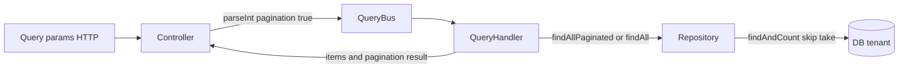

# Listados GET: paginación opcional y forma de respuesta

Cómo el backend construye los **listados** (GET “all”), el contrato `{ items, pagination }` y cómo encaja con el **`TransformInterceptor`** global.

## Contrato que ve el cliente (tras el interceptor)

El controlador/handler devuelve un objeto con:

```json
{
  "items": [ ... ],
  "pagination": { ... } | null
}
```

El **`TransformInterceptor`** detecta que hay `items` (array) y deja `data` como:

```json
{
  "items": [ ... ],
  "pagination": <objeto o null>
}
```

Luego envuelve en el envelope estándar de éxito:

```json
{
  "success": true,
  "statusCode": 200,
  "data": {
    "items": [ ... ],
    "pagination": null | { ... }
  },
  "timestamp": "..."
}
```

Detalle del interceptor: [global-http-response.md](./global-http-response.md).

---

## Dos modos de listado


| Modo               | Activación típica                        | `pagination` en cuerpo | Uso                                             |
| -------------------- | -------------------------------------------- | ------------------------ | ------------------------------------------------- |
| **Lista completa** | No enviar`pagination=true` (o equivalente) | `null`                 | Selects, exportaciones ligeras, pocos registros |
| **Paginado**       | `pagination=true` (string en query)        | Objeto con metadatos   | Tablas UI, listas grandes                       |

### Objeto `pagination` (cuando no es `null`)

Campos habituales en el proyecto:

- `totalItems`
- `totalPages`
- `currentPage` (base **1**)
- `itemsPerPage`
- `hasNextPage`
- `hasPrevPage`

Algunos repositorios devuelven ya `page`, `totalPages`, etc.; el **query handler** o el controlador mapea a esta forma antes de responder.

---

## Parámetros de query HTTP

Los query params llegan como **strings**. El patrón más extendido es:


| Parámetro     | Descripción                                                                                                          |
| ---------------- | ----------------------------------------------------------------------------------------------------------------------- |
| `pagination`   | `'true'` → activar paginación; cualquier otro valor / ausencia → lista completa (`pagination: null` en respuesta). |
| `page`         | Número de página (default**1**).                                                                                    |
| `itemsPerPage` | Tamaño de página (default**10** o **20** según recurso).                                                           |

Filtros de negocio (`exportProcessId`, `status`, `countryId`, `search`, etc.) se añaden **además** y el repositorio los aplica en el `where` / QueryBuilder.

### Variantes en el código (inconsistencias a tener en cuenta)

- Algunos endpoints usan **`isPaginated=true`** además de o en lugar de `pagination=true` (ej. `purchases`, `invoices`).
- **`invoices`**: el `findAll` del controlador calcula `skip`/`take`, ejecuta la query y **monta el objeto `pagination` en el propio controlador** en lugar de delegar todo al handler — se alinea mal con la convención de controladores delgados ([application-layer-conventions.md](./application-layer-conventions.md)).
- Existe un fichero `client.paginated-query-handlers.ts` con otro `@QueryHandler(GetClientsQuery)` que **no** está registrado en `PartnersModule`; el handler activo es `GetClientsHandler` en `client.query-handlers.ts`.

Para integración frontend unificada, la guía ya escrita en el repo es: [`docs/frontend/api-pagination-pattern.md`](../docs/frontend/api-pagination-pattern.md).

---

## Flujo recomendado (capas)



1. **Controller:** lee `page`, `itemsPerPage`, `pagination` (y filtros); convierte tipos; construye la **Query** CQRS.
2. **QueryHandler:** decide si pagina (`pagination === true` en el objeto query); llama al repositorio con `page`/`itemsPerPage` o pide “todos” (a veces con un `take` alto interno).
3. **Repository:** TypeORM `findAndCount` con `skip` / `take`, o `find` sin paginar; devuelve items + total para calcular `totalPages` y flags.

### Ejemplo de repositorio paginado

`TypeOrmClientRepository.findAllPaginated` (`src/modules/partners/infrastructure/adapters/out/persistence/typeorm-client.repository.ts`):

- `skip = (page - 1) * itemsPerPage`
- `findAndCount({ where, relations, skip, take: itemsPerPage })`
- Calcula `totalPages`, `hasNextPage`, `hasPrevPage` y devuelve todo en un solo objeto.

### Ejemplo de handler

`GetClientsHandler` (`client.query-handlers.ts`):

- Si `params.pagination === true` → `findAllPaginated`, enriquece cada ítem (branches, fruits, summary) y devuelve `{ items, pagination }`.
- Si no → `findAll` o `findByCountryId`, mismo enriquecimiento, **`pagination: null`**.

### Ejemplo alternativo (lógica en handler, sin paginar en repo)

`GetPurchasesHandler`: si no hay paginación, usa `itemsPerPage` efectivo muy alto (`99999`) en `repository.findAll` y devuelve `pagination: null`; si hay paginación, construye el objeto `pagination` a partir de `totalItems` y la página actual.

---

La paginación **debe** aplicarse en la base (`skip`/`take`, `LIMIT`); cargar “todo” y paginar en memoria invalida el patrón. Más criterios de rendimiento: [query-optimization.md](./query-optimization.md).

## Qué replicar en una plantilla nueva

1. Misma forma **`{ items, pagination }`** para todos los listados que deban comportarse igual.
2. **`pagination=true`** como interruptor explícito; defaults claros para `page` y `itemsPerPage`.
3. Cálculo de **`skip` / `take`** solo en la capa de persistencia (o en el handler), **no** duplicar reglas de totales en el controlador salvo casos triviales.
4. **`TransformInterceptor`** ya preparado para el shape `items` + `pagination` (código actual del proyecto).
5. Documentar en Swagger los query params y un ejemplo de respuesta paginada / no paginada.

---

## Referencias en código


| Pieza                                      | Ruta                                                                          |
| -------------------------------------------- | ------------------------------------------------------------------------------- |
| Interceptor (shape`items`)                 | `src/shared/infrastructure/interceptors/transform.interceptor.ts`             |
| Guía frontend                             | `docs/frontend/api-pagination-pattern.md`                                     |
| Ejemplo handler + repo                     | `partners` — `GetClientsHandler`, `TypeOrmClientRepository.findAllPaginated` |
| Ejemplo handler compras                    | `purchases` — `GetPurchasesHandler`                                          |
| Ejemplo listado con lógica en controlador | `invoicing` — `InvoicesController.findAll`                                   |

---

## Documentos relacionados

- [global-http-response.md](./global-http-response.md) — envelope global.
- [application-layer-conventions.md](./application-layer-conventions.md) — mover lógica de listados al handler.
- [hexagonal-cqrs.md](./hexagonal-cqrs.md) — Queries y `QueryBus`.
