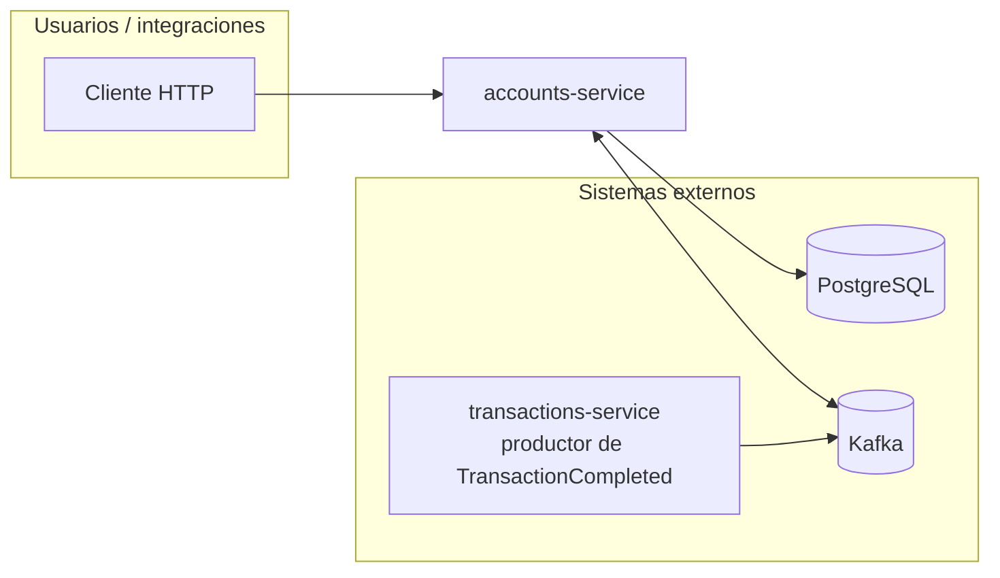
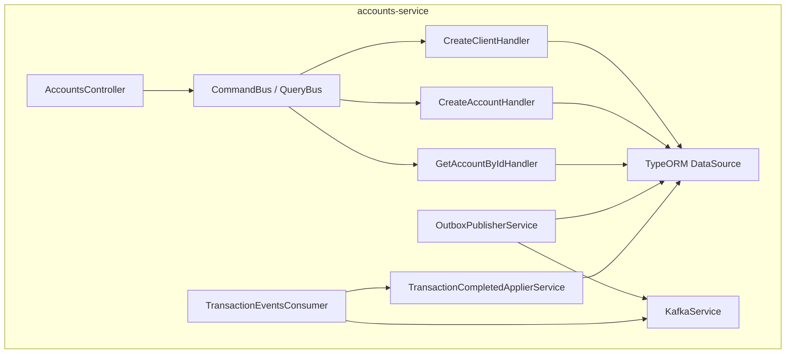
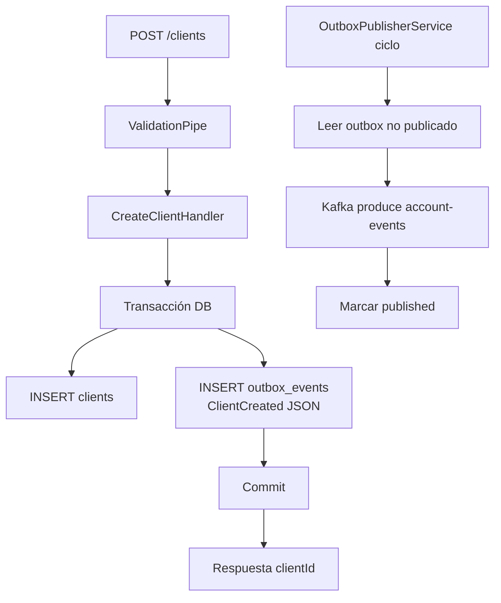
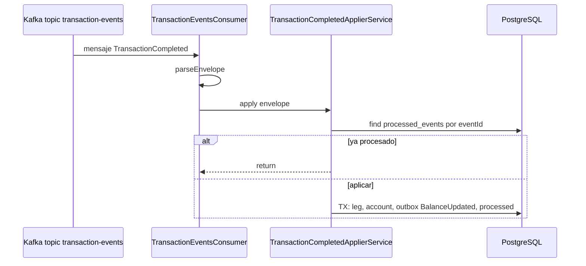
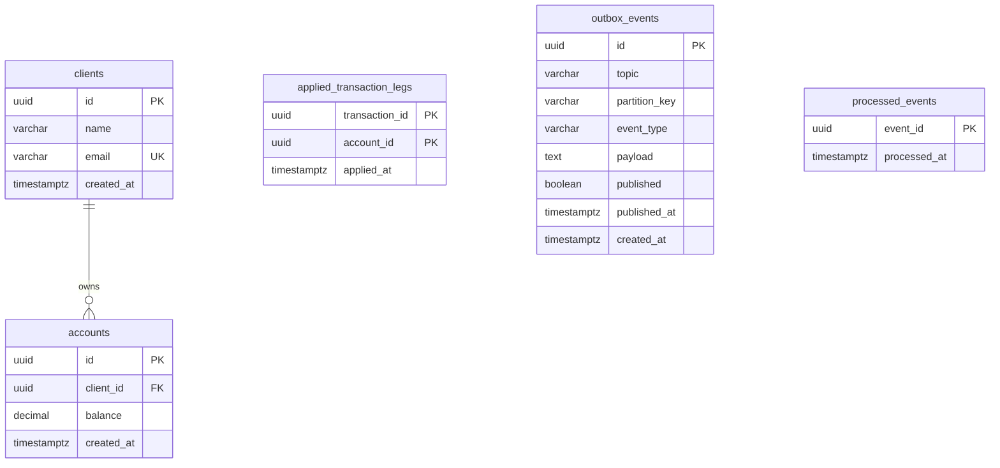

# accounts-service — Documentación técnica

Microservicio NestJS que gestiona **clientes**, **cuentas** y el **saldo autoritativo** en PostgreSQL. Publica eventos de dominio vía patrón **transactional outbox** y consume **`TransactionCompleted`** desde Kafka para actualizar saldos de forma idempotente.

**Puerto por defecto:** `3001` (`PORT` en `.env`).

---

## 1. Módulos registrados (fuente de verdad)

### `AppModule` (`src/app.module.ts`)

| Import | Función |
|--------|---------|
| `ConfigModule.forRoot({ isGlobal: true })` | Variables de entorno globales |
| `TypeOrmModule.forRootAsync(...)` | PostgreSQL vía `DATABASE_URL`, `autoLoadEntities`, `synchronize: true` |
| `AccountsModule` | Único módulo de dominio |

### `AccountsModule` (`src/modules/accounts/accounts.module.ts`)

| Tipo | Registro |
|------|----------|
| **Imports** | `CqrsModule`, `TypeOrmModule.forFeature([ClientOrmEntity, AccountOrmEntity, OutboxEventOrmEntity, ProcessedEventOrmEntity, AppliedTransactionLegOrmEntity])` |
| **Controllers** | `AccountsController` |
| **Handlers CQRS** | `CreateClientHandler`, `CreateAccountHandler`, `GetAccountByIdHandler` |
| **Providers** | `KafkaService`, `OutboxPublisherService`, `TransactionCompletedApplierService`, `TransactionEventsConsumer` |

No existe módulo `AuthModule` ni otros módulos raíz: la superficie queda acotada a cuentas + Kafka.

---

## 2. Organización real del código

```
src/
├── app.module.ts
├── main.ts                          # ValidationPipe, TransformInterceptor, AllExceptionsFilter
├── common/
│   ├── events/event-envelope.ts     # parseEnvelope, EVENT_VERSION
│   └── topics.ts                    # TOPIC_ACCOUNT_EVENTS, TOPIC_TRANSACTION_EVENTS
├── infrastructure/
│   ├── kafka/                       # KafkaService, OutboxPublisher, TransactionEventsConsumer, Applier
│   └── persistence/                 # Entidades TypeORM
├── modules/accounts/
│   ├── accounts.module.ts
│   ├── application/
│   │   ├── commands/                # create-client, create-account + DTOs
│   │   └── queries/                 # get-account-by-id
│   └── infrastructure/adapters/in/rest/
│       └── accounts.controller.ts
└── shared/infrastructure/           # filtros e interceptor HTTP compartidos
```

Patrón: **CQRS** (commands/queries) + **hexagonal light** (REST como adaptador de entrada, Kafka y TypeORM como salida).

---

## 3. API HTTP

| Método | Ruta | Handler / bus | Código HTTP |
|--------|------|---------------|-------------|
| POST | `/clients` | `CreateClientCommand` | 201 |
| POST | `/accounts` | `CreateAccountCommand` | 201 |
| GET | `/accounts/:id` | `GetAccountByIdQuery` | 200 / 404 |

**Validación:** `class-validator` en DTOs (`CreateClientDto`, `CreateAccountDto` con `clientId` UUID).

**Respuesta envuelta:** el `TransformInterceptor` devuelve `{ success, statusCode, data, timestamp }`.

---

## 4. Diagrama C4 — contexto del servicio (C1)



---

## 5. Diagrama C4 — contenedor interno (C2)



---

## 6. Flujo funcional — crear cliente y publicar evento



---

## 7. Diagrama de secuencia — aplicar TransactionCompleted



---

## 8. Base de datos — modelo entidad-relación

**Diagrama ER lógico + modelo físico (tablas, tipos, PK/FK/UK):** [diagramas-er-fisico.md](./diagramas-er-fisico.md).



### Diccionario de datos (resumen)

| Tabla | Propósito |
|-------|-----------|
| `clients` | Titulares; email único |
| `accounts` | Cuenta vinculada a `client_id`; **saldo autoritativo** |
| `outbox_events` | Eventos a publicar en Kafka en la misma transacción de negocio |
| `processed_events` | Idempotencia por `event_id` (Kafka puede reenviar) |
| `applied_transaction_legs` | Idempotencia por par **(transaction_id, account_id)** al aplicar una pata de `TransactionCompleted` |

---

## 9. Eventos Kafka

| Dirección | Topic | Eventos relevantes |
|-----------|-------|-------------------|
| **Publica** | `account-events` | `ClientCreated`, `AccountCreated`, `BalanceUpdated` |
| **Consume** | `transaction-events` | `TransactionCompleted` (actualiza saldo, encola `BalanceUpdated` si aplica) |

Constantes en `src/common/topics.ts`.

**Reglas destacadas en `TransactionCompletedApplierService`:** no permitir saldo negativo; ignorar cuenta desconocida; no duplicar aplicación por leg ya existente.

---

## 10. Servicios externos e integraciones

| Sistema | Uso | Configuración |
|---------|-----|---------------|
| **PostgreSQL** | Persistencia | `DATABASE_URL` |
| **Kafka / Redpanda** | Mensajería | `KAFKA_BROKERS` (lista separada por comas) |
| **kafkajs** | Cliente producer/consumer | Dependencia npm |

No hay llamadas a APIs REST de terceros en este servicio.

---

## 11. Variables de entorno (referencia)

Ver `services/accounts-service/.env.example`: `PORT`, `DATABASE_URL`, `KAFKA_BROKERS`.

---

## 12. Documentos relacionados

- [Índice 04-services](../index.md)
- [Guía Ollama](../../07-team/guia-ollama-local.md) (no aplica a accounts; enlazada desde ai)
- [Tests por microservicio](../../05-test/tests-por-microservicio.md)

[← Índice 04-services](../index.md)
