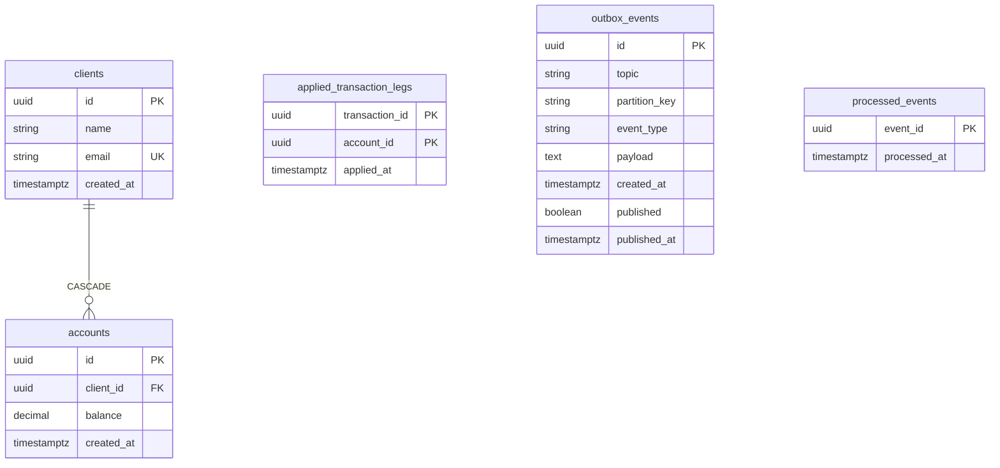

# accounts-service — Diagrama ER (lógico) y modelo físico

Fuente de verdad: entidades TypeORM en `services/accounts-service/src/infrastructure/persistence/`. Base Postgres dedicada (p. ej. `accounts` en `docker/init-db.sql`).

[Volver a accounts-service.md](./accounts-service.md) · [Índice 04-services](../README.md)

---

## 1. Diagrama ER (lógico)

Enfoque en **dominio** (cliente → cuentas) y tablas de **infraestructura** (outbox, idempotencia, patas aplicadas). No hay FK en BD desde `applied_transaction_legs` hacia `accounts`; el `account_id` es referencia al dominio de transacciones / cuentas.

**Notas lógicas**

- **`applied_transaction_legs`:** idempotencia por pata `(transaction_id, account_id)` al consumir `TransactionCompleted`; no declara relación ORM con `accounts`.
- **`outbox_events` / `processed_events`:** soporte a publicación Kafka e idempotencia de consumo; independientes del grafo cliente-cuenta.

---

## 2. Diagrama / modelo físico (PostgreSQL)

Mapeo columnas → tipos y restricciones que TypeORM genera con `synchronize: true` (orden aproximado al esquema real).

### 2.1 Tabla `clients`

| Columna | Tipo físico | Nulidad | Restricciones |
|---------|-------------|---------|----------------|
| `id` | `uuid` | NOT NULL | PK (default gen. UUID) |
| `name` | `varchar(255)` | NOT NULL | |
| `email` | `varchar(255)` | NOT NULL | **UNIQUE** |
| `created_at` | `timestamptz` | NOT NULL | default `now()` |

### 2.2 Tabla `accounts`

| Columna | Tipo físico | Nulidad | Restricciones |
|---------|-------------|---------|----------------|
| `id` | `uuid` | NOT NULL | PK |
| `client_id` | `uuid` | NOT NULL | **FK → `clients(id)` ON DELETE CASCADE** |
| `balance` | `numeric(18,2)` | NOT NULL | default `0` |
| `created_at` | `timestamptz` | NOT NULL | default `now()` |

### 2.3 Tabla `applied_transaction_legs`

| Columna | Tipo físico | Nulidad | Restricciones |
|---------|-------------|---------|----------------|
| `transaction_id` | `uuid` | NOT NULL | **PK (compuesta)** |
| `account_id` | `uuid` | NOT NULL | **PK (compuesta)** |
| `applied_at` | `timestamptz` | NOT NULL | |

Sin FK a `accounts` ni a otra BD (el `transaction_id` es identificador del bounded context de transacciones).

### 2.4 Tabla `outbox_events`

| Columna | Tipo físico | Nulidad | Restricciones |
|---------|-------------|---------|----------------|
| `id` | `uuid` | NOT NULL | PK |
| `topic` | `varchar(128)` | NOT NULL | |
| `partition_key` | `varchar(128)` | NULL | |
| `event_type` | `varchar(128)` | NOT NULL | |
| `payload` | `text` | NOT NULL | JSON del envelope |
| `created_at` | `timestamptz` | NOT NULL | default `now()` |
| `published` | `boolean` | NOT NULL | default `false` |
| `published_at` | `timestamptz` | NULL | |

### 2.5 Tabla `processed_events`

| Columna | Tipo físico | Nulidad | Restricciones |
|---------|-------------|---------|----------------|
| `event_id` | `uuid` | NOT NULL | PK |
| `processed_at` | `timestamptz` | NOT NULL | |

### 2.6 Vista Mermaid (mismo modelo físico, compacto)

*(Tipos exactos `varchar(n)`, `numeric(18,2)` y columnas nullable en §2.1–2.5.)*

---

## 3. Referencias de código

| Tabla | Entidad |
|-------|---------|
| `clients` | `client.orm-entity.ts` |
| `accounts` | `account.orm-entity.ts` |
| `applied_transaction_legs` | `applied-transaction-leg.orm-entity.ts` |
| `outbox_events` | `outbox-event.orm-entity.ts` |
| `processed_events` | `processed-event.orm-entity.ts` |
