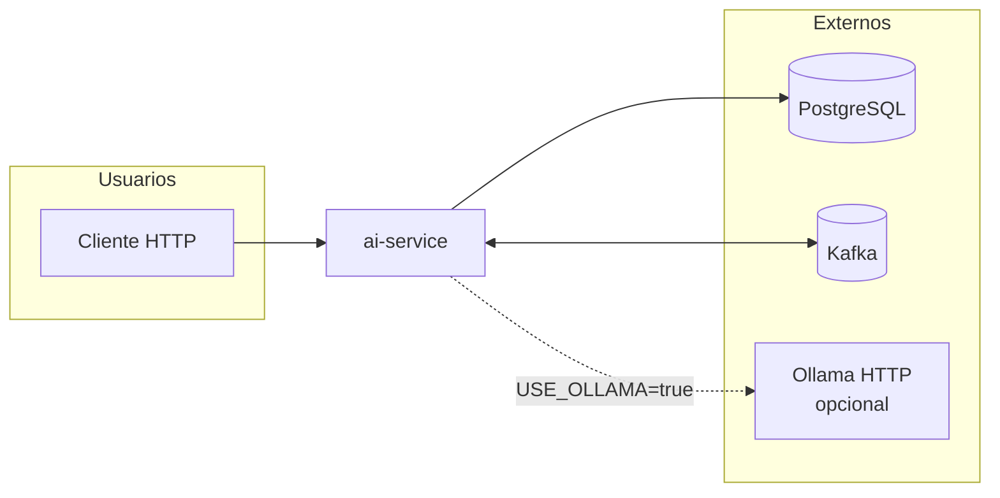
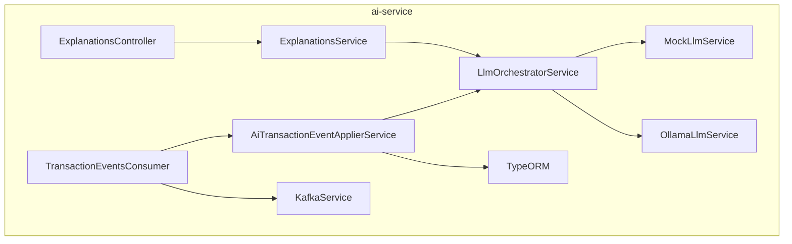
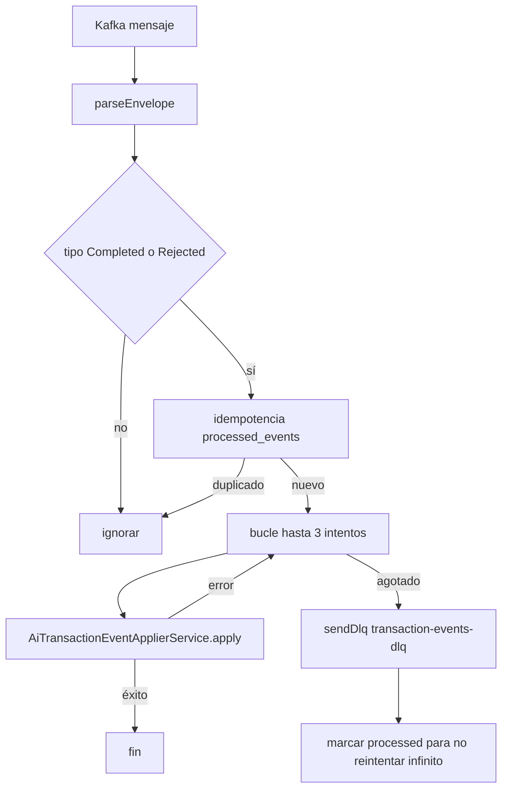
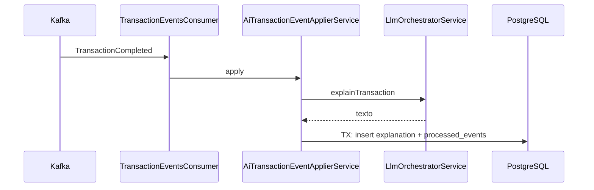
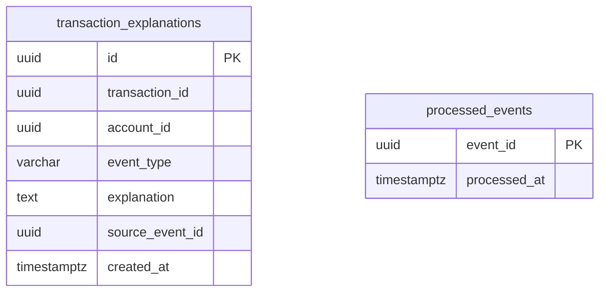

# ai-service — Documentación técnica

Microservicio NestJS que **consume** eventos de transacciones finalizadas (`TransactionCompleted`, `TransactionRejected`), genera **textos explicativos** mediante un **LLM** (modo mock por defecto o **Ollama** vía HTTP) y expone **consultas HTTP** sobre explicaciones almacenadas y **resumen de historial por cuenta**.

**Puerto por defecto:** `3003` (`PORT` en `.env`).

**No usa CQRS:** un único módulo `ExplanationsModule` con controller + servicio + infraestructura Kafka/LLM.

---

## 1. Módulos registrados (fuente de verdad)

### `AppModule` (`src/app.module.ts`)

| Import | Función |
|--------|---------|
| `ConfigModule.forRoot({ isGlobal: true })` | Config global |
| `TypeOrmModule.forRootAsync(...)` | PostgreSQL |
| `ExplanationsModule` | Feature única |

### `ExplanationsModule` (`src/modules/explanations/explanations.module.ts`)

| Tipo | Registro |
|------|----------|
| **Imports** | `TypeOrmModule.forFeature([ProcessedEventOrmEntity, TransactionExplanationOrmEntity])` |
| **Controllers** | `ExplanationsController` |
| **Providers** | `ExplanationsService`, `KafkaService`, `MockLlmService`, `OllamaLlmService`, `LlmOrchestratorService`, `AiTransactionEventApplierService`, `TransactionEventsConsumer` |

---

## 2. Organización real del código

```
src/
├── app.module.ts
├── main.ts
├── common/events, common/topics
├── infrastructure/
│   ├── kafka/
│   │   ├── kafka.service.ts          # producer + creación topics + sendDlq
│   │   ├── transaction-events.consumer.ts
│   │   ├── ai-transaction-event-applier.service.ts
│   │   ├── llm-orchestrator.service.ts
│   │   ├── mock-llm.service.ts
│   │   └── ollama-llm.service.ts     # fetch HTTP a Ollama
│   └── persistence/
│       ├── processed-event.orm-entity.ts
│       └── transaction-explanation.orm-entity.ts
└── modules/explanations/
    ├── explanations.module.ts
    ├── explanations.controller.ts
    └── explanations.service.ts
```

---

## 3. API HTTP

| Método | Ruta | Notas |
|--------|------|--------|
| GET | `/explanations/account/:accountId/summary` | Debe declararse **antes** de la ruta con `:transactionId` para no capturar `account` como UUID |
| GET | `/explanations/:transactionId` | Lista de explicaciones por transacción; **404** si aún no hay filas |

**Respuestas:** mismo patrón global `TransformInterceptor` + manejo de errores `AllExceptionsFilter`.

---

## 4. Diagrama C4 — contexto (C1)



---

## 5. Diagrama C4 — contenedor interno (C2)



---

## 6. Flujo funcional — consumo y reintentos



---

## 7. Diagrama de secuencia — explicación persistida



Para `TransactionCompleted`, se persiste `accountId` del payload cuando existe, lo que habilita el resumen por cuenta.

---

## 8. Base de datos — modelo ER

**Diagrama ER lógico + modelo físico (tablas, tipos, índices, UNIQUE):** [diagramas-er-fisico.md](./diagramas-er-fisico.md).



### Diccionario de datos (resumen)

| Tabla | Propósito |
|-------|-----------|
| `transaction_explanations` | Texto generado por evento (`source_event_id` único); `account_id` nullable (útil en completados) |
| `processed_events` | Idempotencia y cierre tras DLQ |

---

## 9. Integración LLM

| Modo | Activación | Implementación |
|------|------------|----------------|
| **Mock** | Por defecto (`USE_OLLAMA` distinto de `true`) | `MockLlmService` — sin red |
| **Ollama** | `USE_OLLAMA=true` | `OllamaLlmService` — `fetch` POST a `{OLLAMA_BASE_URL}/api/chat` |

Orquestación centralizada en `LlmOrchestratorService` (`explainTransaction`, `summarizeAccountHistory`, `providerLabel`).

Guía operativa: [../../07-team/guia-ollama-local.md](../../07-team/guia-ollama-local.md).

---

## 10. Servicios externos e integraciones

| Servicio / librería | Uso |
|---------------------|-----|
| PostgreSQL | Persistencia |
| Kafka / Redpanda | Consumer `transaction-events`; producer hacia **DLQ** |
| **Ollama** (opcional) | API REST local compatible con `/api/chat` |
| **kafkajs** | Cliente Kafka |
| **fetch** (runtime Node) | Llamadas HTTP a Ollama |

No hay autenticación OAuth ni SDKs cloud en el código actual.

---

## 11. Topics Kafka

| Topic | Uso en ai-service |
|-------|-------------------|
| `transaction-events` | Suscripción del consumidor |
| `transaction-events-dlq` | Mensajes que fallan tras reintentos (`KafkaService.sendDlq`) |

Creación best-effort de topics en `KafkaService.onModuleInit`.

---

## 12. Variables de entorno (referencia)

Ver `services/ai-service/.env.example`: `PORT`, `DATABASE_URL`, `KAFKA_BROKERS`, `KAFKA_CONSUMER_FROM_BEGINNING` (en local suele ser `true` para no perder `TransactionCompleted` si el consumer tarda en unirse al grupo), `USE_OLLAMA`, `OLLAMA_*`.

---

## 13. Documentos relacionados

- [Índice 04-services](../index.md)
- [Guía Ollama local](../../07-team/guia-ollama-local.md)
- [Tests por microservicio](../../05-test/tests-por-microservicio.md)

[← Índice 04-services](../index.md)
