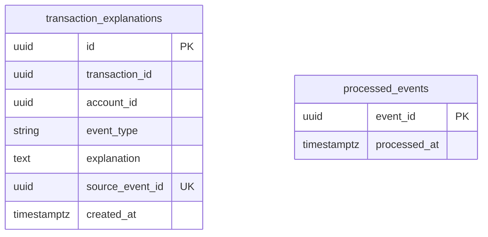

# ai-service — Diagrama ER (lógico) y modelo físico

Fuente de verdad: entidades TypeORM en `services/ai-service/src/infrastructure/persistence/`. Base Postgres dedicada (p. ej. `ai` en `docker/init-db.sql`).

[Volver a ai-service.md](./ai-service.md) · [Índice 04-services](../README.md)

---

## 1. Diagrama ER (lógico)

Solo dos tablas. No hay FK a `transactions` de otro servicio: `transaction_id` y `account_id` son **referencias lógicas** a datos que viven en otros bounded contexts.

**Notas lógicas**

- **`source_event_id`:** alinea una fila de explicación con un **`eventId`** del bus (único a nivel tabla); refuerzo de idempotencia junto con `processed_events`.
- **`processed_events`:** evita reprocesar el mismo mensaje Kafka (y permite cerrar el flujo tras DLQ sin fila de explicación).

---

## 2. Modelo físico (PostgreSQL)

### 2.1 Tabla `transaction_explanations`

| Columna | Tipo físico | Nulidad | Restricciones |
|---------|-------------|---------|----------------|
| `id` | `uuid` | NOT NULL | PK (generado) |
| `transaction_id` | `uuid` | NOT NULL | índice (`@Index()`) |
| `account_id` | `uuid` | NULL | índice (`@Index()`) |
| `event_type` | `varchar(64)` | NOT NULL | |
| `explanation` | `text` | NOT NULL | |
| `source_event_id` | `uuid` | NOT NULL | **UNIQUE** |
| `created_at` | `timestamptz` | NOT NULL | |

### 2.2 Tabla `processed_events`

| Columna | Tipo físico | Nulidad | Restricciones |
|---------|-------------|---------|----------------|
| `event_id` | `uuid` | NOT NULL | PK |
| `processed_at` | `timestamptz` | NOT NULL | |

### 2.3 Vista Mermaid (compacta)

*(Índices en `transaction_id` y `account_id`, y `UNIQUE` en `source_event_id`, en §2.1.)*

---

## 3. Referencias de código

| Tabla | Entidad |
|-------|---------|
| `transaction_explanations` | `transaction-explanation.orm-entity.ts` |
| `processed_events` | `processed-event.orm-entity.ts` |
