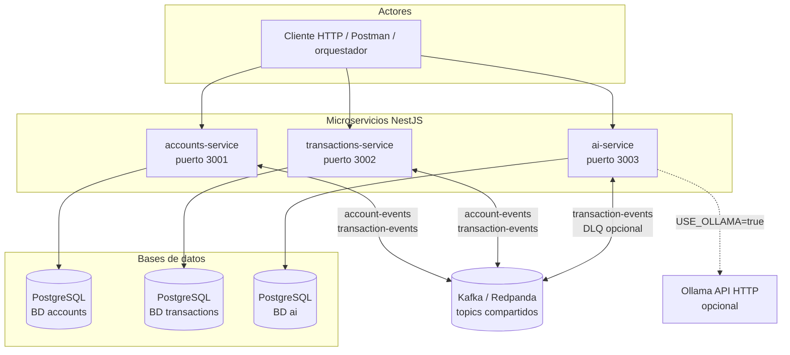

# Documentación técnica — microservicios Arkano

Este capítulo describe **cada microservicio NestJS** tal como está implementado en el repositorio: módulos registrados, persistencia, Kafka, APIs HTTP e integraciones externas. Los diagramas usan [Mermaid](https://mermaid.live/) (sintaxis verificada para `flowchart`, `sequenceDiagram` y `erDiagram`).

## Visión de plataforma (contexto)

## Contenedores lógicos por servicio

| Servicio | Rol principal | Topics Kafka | Base de datos propia |
|----------|---------------|--------------|----------------------|
| [accounts-service](./accounts/accounts-service.md) | Clientes, cuentas, **saldo autoritativo**, outbox de eventos de cuenta | Consume `transaction-events`; publica `account-events` | Sí |
| [transactions-service](./transactions/transactions-service.md) | Solicitudes de movimiento, snapshots para reglas, ejecución async vía eventos | Consume `account-events`, `transaction-events`; publica `transaction-events` | Sí |
| [ai-service](./ai/ai-service.md) | Explicaciones en lenguaje natural y resumen por cuenta | Consume `transaction-events`; publica a DLQ si falla tras reintentos | Sí |

## Documentos por microservicio

| Documento | Contenido |
|-----------|-----------|
| [accounts/accounts-service.md](./accounts/accounts-service.md) | `AppModule`, `AccountsModule`, CQRS, outbox, consumidor `TransactionCompleted`, modelo ER |
| [accounts/diagramas-er-fisico.md](./accounts/diagramas-er-fisico.md) | ER lógico + modelo físico PostgreSQL |
| [transactions/transactions-service.md](./transactions/transactions-service.md) | `TransactionsModule`, `TransactionExecuteService`, snapshots, consumidores |
| [transactions/diagramas-er-fisico.md](./transactions/diagramas-er-fisico.md) | ER lógico + modelo físico PostgreSQL |
| [ai/ai-service.md](./ai/ai-service.md) | `ExplanationsModule`, LLM mock/Ollama, reintentos y DLQ |
| [ai/diagramas-er-fisico.md](./ai/diagramas-er-fisico.md) | ER lógico + modelo físico PostgreSQL |

## Convenciones transversales

- **NestJS:** `ConfigModule` global, `TypeOrmModule` con `DATABASE_URL`, `synchronize: true` (adecuado para entorno de desafío; en producción usar migraciones).
- **HTTP:** `ValidationPipe` global (whitelist, forbid non-whitelisted), `TransformInterceptor` (respuestas `{ success, data, ... }`), `AllExceptionsFilter`.
- **Eventos:** envelope JSON con `eventId`, `eventType`, `source`, `occurredAt`, `version`, `payload` (ver código en `common/events/event-envelope.ts` de cada servicio).

[← Índice general de documentación](../README.md)
