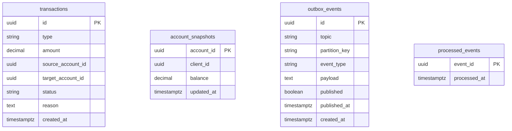
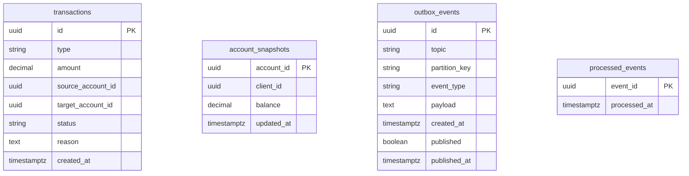

# transactions-service — Diagrama ER (lógico) y modelo físico

Fuente de verdad: entidades TypeORM en `services/transactions-service/src/infrastructure/persistence/`. Base Postgres dedicada (p. ej. `transactions` en `docker/init-db.sql`).

[Volver a transactions-service.md](./transactions-service.md) · [Índice 04-services](../README.md)

---

## 1. Diagrama ER (lógico)

El servicio **no** replica la FK entre `transactions` y `account_snapshots` en ORM: los snapshots se alimentan por **eventos** Kafka (`account-events`); `transactions` se crea por API y se actualiza por el consumidor de `TransactionRequested`.

**Notas lógicas**

- **`transactions`:** ciclo de vida del movimiento (`pending` → `completed` / `rejected`).
- **`account_snapshots`:** proyección local por `account_id` para validar depósitos, retiros y transferencias sin consultar la BD de accounts.
- **`outbox_events`:** publicación de `TransactionRequested`, `TransactionCompleted`, `TransactionRejected`.
- **`processed_events`:** idempotencia al consumir eventos (p. ej. `TransactionRequested`, `AccountCreated`, `BalanceUpdated`).

---

## 2. Modelo físico (PostgreSQL)

### 2.1 Tabla `transactions`

| Columna | Tipo físico | Nulidad | Restricciones |
|---------|-------------|---------|----------------|
| `id` | `uuid` | NOT NULL | PK |
| `type` | `varchar(32)` | NOT NULL | valores app: deposit, withdrawal, transfer |
| `amount` | `numeric(18,2)` | NOT NULL | |
| `source_account_id` | `uuid` | NULL | |
| `target_account_id` | `uuid` | NULL | |
| `status` | `varchar(32)` | NOT NULL | pending, completed, rejected |
| `reason` | `text` | NULL | |
| `created_at` | `timestamptz` | NOT NULL | default `now()` |

Sin FK a `account_snapshots` (referencias a cuentas son identificadores lógicos del dominio distribuido).

### 2.2 Tabla `account_snapshots`

| Columna | Tipo físico | Nulidad | Restricciones |
|---------|-------------|---------|----------------|
| `account_id` | `uuid` | NOT NULL | PK |
| `client_id` | `uuid` | NULL | |
| `balance` | `numeric(18,2)` | NOT NULL | |
| `updated_at` | `timestamptz` | NOT NULL | actualizado en cada aplicación de evento de cuenta |

### 2.3 Tabla `outbox_events`

| Columna | Tipo físico | Nulidad | Restricciones |
|---------|-------------|---------|----------------|
| `id` | `uuid` | NOT NULL | PK |
| `topic` | `varchar(128)` | NOT NULL | |
| `partition_key` | `varchar(128)` | NULL | |
| `event_type` | `varchar(128)` | NOT NULL | |
| `payload` | `text` | NOT NULL | |
| `created_at` | `timestamptz` | NOT NULL | default `now()` |
| `published` | `boolean` | NOT NULL | default `false` |
| `published_at` | `timestamptz` | NULL | |

### 2.4 Tabla `processed_events`

| Columna | Tipo físico | Nulidad | Restricciones |
|---------|-------------|---------|----------------|
| `event_id` | `uuid` | NOT NULL | PK |
| `processed_at` | `timestamptz` | NOT NULL | |

### 2.5 Vista Mermaid (compacta)

---

## 3. Referencias de código

| Tabla | Entidad |
|-------|---------|
| `transactions` | `transaction.orm-entity.ts` |
| `account_snapshots` | `account-snapshot.orm-entity.ts` |
| `outbox_events` | `outbox-event.orm-entity.ts` |
| `processed_events` | `processed-event.orm-entity.ts` |
