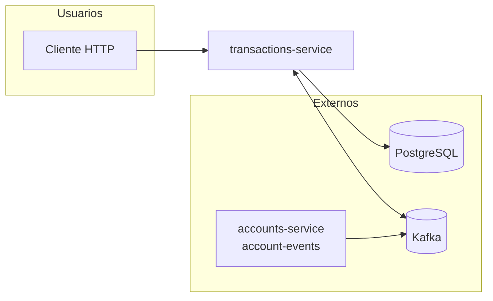
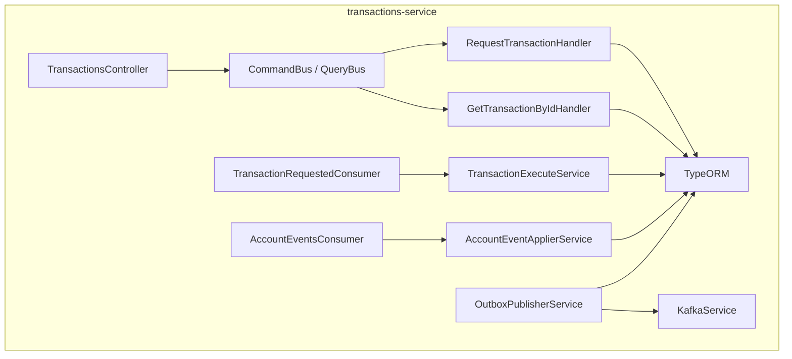
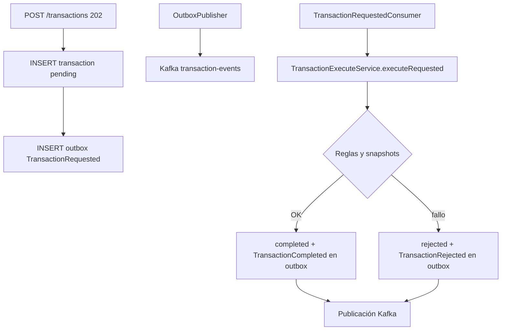
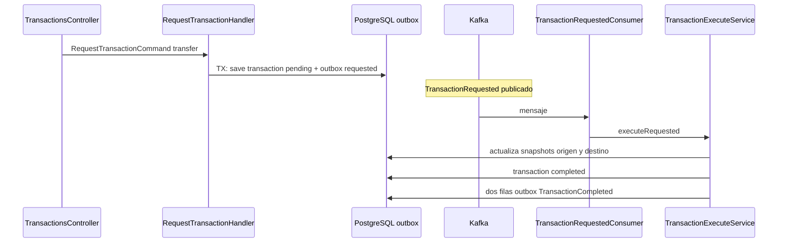
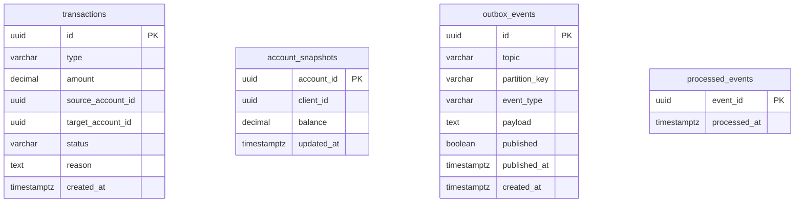

# transactions-service — Documentación técnica

Microservicio NestJS que recibe **solicitudes de transacciones** (depósito, retiro, transferencia), las deja en estado **pending** con evento **TransactionRequested** en outbox, y **ejecuta** la lógica al consumir ese evento: actualiza **snapshots locales** de cuentas, cambia estado de la transacción y publica **TransactionCompleted** o **TransactionRejected**.

**Puerto por defecto:** `3002` (`PORT` en `.env`).

---

## 1. Módulos registrados (fuente de verdad)

### `AppModule` (`src/app.module.ts`)


| Import                                     | Función                    |
| -------------------------------------------- | ----------------------------- |
| `ConfigModule.forRoot({ isGlobal: true })` | Configuración global       |
| `TypeOrmModule.forRootAsync(...)`          | PostgreSQL (`DATABASE_URL`) |
| `TransactionsModule`                       | Único módulo de feature   |

### `TransactionsModule` (`src/modules/transactions/transactions.module.ts`)


| Tipo            | Registro                                                                                                                                                     |
| ----------------- | -------------------------------------------------------------------------------------------------------------------------------------------------------------- |
| **Imports**     | `CqrsModule`, `TypeOrmModule.forFeature([TransactionOrmEntity, AccountSnapshotOrmEntity, OutboxEventOrmEntity, ProcessedEventOrmEntity])`                    |
| **Controllers** | `TransactionsController`                                                                                                                                     |
| **Handlers**    | `RequestTransactionHandler`, `GetTransactionByIdHandler`                                                                                                     |
| **Providers**   | `KafkaService`, `OutboxPublisherService`, `AccountEventApplierService`, `AccountEventsConsumer`, `TransactionExecuteService`, `TransactionRequestedConsumer` |

---

## 2. Organización real del código

```
src/
├── app.module.ts
├── main.ts
├── common/events, common/topics
├── infrastructure/
│   ├── kafka/
│   │   ├── kafka.service.ts
│   │   ├── outbox-publisher.service.ts
│   │   ├── account-events.consumer.ts      # suscripción account-events
│   │   ├── account-event-applier.service.ts
│   │   ├── transaction-requested.consumer.ts
│   │   └── transaction-execute.service.ts    # núcleo de reglas
│   └── persistence/
│       ├── transaction.orm-entity.ts
│       ├── account-snapshot.orm-entity.ts
│       ├── outbox-event.orm-entity.ts
│       └── processed-event.orm-entity.ts
└── modules/transactions/
    ├── transactions.module.ts
    ├── application/commands, queries, dtos
    └── infrastructure/adapters/in/rest/transactions.controller.ts
```

El **núcleo de negocio** de ejecución está en `TransactionExecuteService` (no en un handler CQRS directo del POST), porque el flujo es **asíncrono** vía Kafka.

---

## 3. API HTTP


| Método | Ruta                | Comportamiento                                                                   |
| --------- | --------------------- | ---------------------------------------------------------------------------------- |
| POST    | `/transactions`     | **202** — Crea fila `transactions` en `pending` + outbox `TransactionRequested` |
| GET     | `/transactions/:id` | **200** vista / **404** si no existe                                             |

**DTO** `RequestTransactionDto`: `type` ∈ deposit | withdrawal | transfer, `amount` > 0, `sourceAccountId` / `targetAccountId` opcionales según tipo. Validaciones adicionales en `RequestTransactionHandler` (p. ej. transfer requiere ambas cuentas).

---

## 4. Diagrama C4 — contexto (C1)



---

## 5. Diagrama C4 — contenedor interno (C2)



---

## 6. Flujo funcional — de solicitud a completado



---

## 7. Diagrama de secuencia — transferencia exitosa



Cada **TransactionCompleted** lleva `transactionId`, `amount` (+/-) y `accountId` para que **accounts-service** aplique el movimiento en el saldo global.

---

## 8. Estados y reglas (resumen)


| Estado      | Significado                                            |
| ------------- | -------------------------------------------------------- |
| `pending`   | Registrada; esperando procesamiento del consumidor     |
| `completed` | Ejecutada; eventos de resultado en outbox              |
| `rejected`  | Rechazada con`reason`; `TransactionRejected` en outbox |

**Snapshots (`account_snapshots`):** réplica local alimentada por `AccountCreated` y `BalanceUpdated` desde `account-events`. La ejecución valida existencia y fondos contra estos datos (no contra la BD de accounts en tiempo real).

---

## 9. Base de datos — modelo ER

**Diagrama ER lógico + modelo físico (tablas, tipos, PK/constraints):** [diagramas-er-fisico.md](./diagramas-er-fisico.md).



### Diccionario de datos (resumen)


| Tabla               | Propósito                                              |
| --------------------- | --------------------------------------------------------- |
| `transactions`      | Solicitud y estado del movimiento                       |
| `account_snapshots` | Vista local para validar cuentas y saldos en ejecución |
| `outbox_events`     | Outbox hacia`transaction-events`                        |
| `processed_events`  | Idempotencia de consumo de eventos entrantes            |

---

## 10. Eventos Kafka


| Topic                | Rol                                                                                                                     |
| ---------------------- | ------------------------------------------------------------------------------------------------------------------------- |
| `account-events`     | **Consume:** `AccountCreated`, `BalanceUpdated` → actualiza `account_snapshots`                                        |
| `transaction-events` | **Consume:** `TransactionRequested`; **publica:** `TransactionRequested`, `TransactionCompleted`, `TransactionRejected` |

El topic `transaction-events-dlq` está definido en constantes compartidas con ai-service; **el productor DLQ** para mensajes fallidos está implementado en **ai-service**, no en transactions.

---

## 11. Servicios externos


| Sistema                          | Uso                                                |
| ---------------------------------- | ---------------------------------------------------- |
| PostgreSQL                       | Persistencia                                       |
| Kafka / Redpanda                 | Orquestación asíncrona                           |
| **accounts-service** (indirecto) | Eventos en`account-events` que alimentan snapshots |

---

## 12. Variables de entorno

`DATABASE_URL`, `KAFKA_BROKERS`, `PORT` — ver `.env.example` del servicio.

---

## 13. Documentos relacionados

- [Índice 04-services](../index.md)
- [accounts-service](../accounts/accounts-service.md)
- [ai-service](../ai/ai-service.md)

[← Índice 04-services](../index.md)
