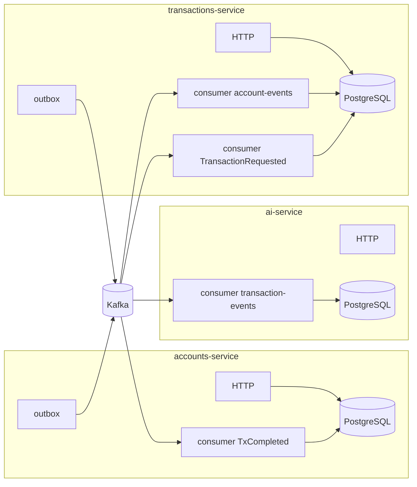

# Guía paso a paso: endpoints y flujo event-driven

Esta guía recorre los **endpoints en orden progresivo** (como en la colección Postman), indica **qué envías y qué recibes**, y describe **qué ocurre dentro de cada servicio** y **cómo se encadenan los eventos** en Kafka.

**Prerrequisitos:** Docker (`docker compose up -d`), los tres microservicios en marcha (`npm run start:dev` en cada uno, idealmente **accounts → transactions → ai**), `.env` con `DATABASE_URL` y `KAFKA_BROKERS=localhost:19092`.

**URLs base:** accounts `http://localhost:3001`, transactions `http://localhost:3002`, ai `http://localhost:3003`.

### Logs del bus de eventos (`[EVENT-BUS]`)

En consola, los tres servicios escriben líneas con el prefijo **`[EVENT-BUS]`** para seguir Kafka sin mirar el broker:

| Prefijo / palabra | Significado |
|-------------------|-------------|
| `PUBLISH [servicio] -> topic=...` | El producer envió un mensaje (normalmente tras vaciar el **outbox**). Incluye `eventType`, `eventId` y a veces `transactionId` / `accountId`. |
| `CONSUME [servicio] <- topic=...` | Llegó un mensaje al consumidor (`partition`, `offset`, `eventType`, `eventId`). |
| `SKIP` | El mensaje no aplica a ese servicio (p. ej. AI ignora `TransactionRequested`) o ya estaba procesado (idempotencia). |
| `EXEC` / `DONE` | Empieza / termina el trabajo de negocio para ese evento. |
| `PUBLISH ... DLQ` (ai-service) | Mensaje enviado a **dead letter** tras reintentos fallidos. |

Orden típico al hacer un depósito: **PUBLISH** `TransactionRequested` (transactions) → **CONSUME** + **EXEC/DONE** (transactions) → varios **PUBLISH** `TransactionCompleted` → **CONSUME** (accounts + ai) → **PUBLISH** `BalanceUpdated` (accounts) → **CONSUME** (transactions snapshot).

---

## Cómo leer las respuestas HTTP

### Éxito (todos los servicios)

El `TransformInterceptor` envuelve el cuerpo:

```json
{
  "success": true,
  "statusCode": 201,
  "data": { ... },
  "timestamp": "2026-04-08T12:00:00.000Z"
}
```

El payload útil está siempre en **`data`**.

### Error

```json
{
  "success": false,
  "statusCode": 400,
  "data": null,
  "message": "...",
  "error": "Bad Request",
  "timestamp": "..."
}
```

---

## Orden recomendado (resumen)

| # | Servicio | Endpoint | Rol en el flujo |
|---|----------|----------|-----------------|
| 1 | Accounts | `POST /clients` | Crea titular |
| 2 | Accounts | `POST /accounts` | Crea cuenta (saldo 0) + evento `AccountCreated` |
| 3 | *(espera)* | — | Kafka + snapshot en transactions |
| 4 | Transactions | `POST /transactions` (depósito) | Solicitud async + `TransactionRequested` |
| 5 | Transactions | `GET /transactions/:id` *(varias veces)* | Polling hasta `completed` / `rejected` |
| 6 | Accounts | `GET /accounts/:id` | Ver saldo autoritativo actualizado |
| 7 | AI | `GET /explanations/:transactionId` | Explicaciones generadas |
| 8 | AI | `GET /explanations/account/:accountId/summary` | Resumen por cuenta *(tras varios movimientos)* |
| *+* | Accounts | Cliente/cuenta 2 + `POST /transactions` transfer | Flujo con dos cuentas |

---

## Paso 1 — Registrar cliente

### Request

- **Servicio:** accounts (3001)  
- **Método / ruta:** `POST /clients`  
- **Headers:** `Content-Type: application/json`  
- **Body:**

```json
{
  "name": "Ana López",
  "email": "ana.ejemplo@dominio.com"
}
```

*(El email debe ser único; si repites, fallará por restricción de BD.)*

### Response típica — `201 Created`

```json
{
  "success": true,
  "statusCode": 201,
  "data": {
    "clientId": "uuid-del-cliente"
  },
  "timestamp": "..."
}
```

**Guarda `data.clientId`** para el paso 2.

### Qué pasa internamente (accounts-service)

1. `AccountsController` → `CommandBus` → **`CreateClientHandler`**.
2. Dentro de una **transacción TypeORM**:
   - `INSERT` en tabla **`clients`** (`id`, `name`, `email`).
   - `INSERT` en **`outbox_events`**: `topic` = `account-events`, `eventType` = `ClientCreated`, `payload` = JSON del **envelope** (`eventId`, `eventType`, `source`, `occurredAt`, `version`, `payload` con `clientId`, `name`, `email`), `published` = false.
3. Commit. La respuesta HTTP sale **antes** de que Kafka reciba el mensaje.

### Event-driven (asíncrono)

4. **`OutboxPublisherService`** (cron/timer) lee filas de `outbox_events` con `published = false`, envía a Kafka topic **`account-events`** y marca `published = true`.
5. **transactions-service** (`AccountEventsConsumer`) solo reacciona a **`AccountCreated`** y **`BalanceUpdated`**. El mensaje **`ClientCreated`** se publica igual en el topic, pero **este consumidor lo ignora** (no hay snapshot sin `accountId`). Lo que desbloquea transacciones es el **paso 2** (`AccountCreated`).

---

## Paso 2 — Crear cuenta bancaria

### Request

- **Método / ruta:** `POST /accounts`  
- **Body:**

```json
{
  "clientId": "<uuid del paso 1>"
}
```

### Response — `201 Created`

```json
{
  "success": true,
  "statusCode": 201,
  "data": {
    "accountId": "uuid-de-la-cuenta"
  },
  "timestamp": "..."
}
```

**Guarda `data.accountId`**.

### Qué pasa internamente (accounts-service)

1. **`CreateAccountHandler`**: comprueba que el `clientId` exista en `clients`; si no → **404**.
2. Transacción:
   - `INSERT` **`accounts`**: `balance` inicial `"0.00"`.
   - `INSERT` **`outbox_events`**: evento **`AccountCreated`** hacia **`account-events`**, envelope con `accountId`, `clientId`, `balance: 0`.

### Event-driven

3. Outbox publica en Kafka **`account-events`**.
4. **transactions-service — `AccountEventApplierService.applyAccountCreated`**: en transacción inserta/actualiza **`account_snapshots`** (`account_id`, `client_id`, `balance`) para poder validar depósitos/retiros/transferencias **sin** llamar por HTTP a accounts.

**Importante:** deja pasar **1–3 segundos** antes del primer `POST /transactions` para que el snapshot exista; si no, la transacción puede ir a **`rejected`** (cuenta desconocida en el servicio de transacciones).

---

## Paso 3 — Depósito (solicitud de transacción)

### Request

- **Servicio:** transactions (3002)  
- **Método / ruta:** `POST /transactions`  
- **Body:**

```json
{
  "type": "deposit",
  "amount": 100,
  "targetAccountId": "<accountId del paso 2>"
}
```

### Response — `202 Accepted`

```json
{
  "success": true,
  "statusCode": 202,
  "data": {
    "transactionId": "uuid-de-la-transaccion",
    "status": "pending"
  },
  "timestamp": "..."
}
```

**Guarda `data.transactionId`.** El estado en BD es **pending**; el dinero **aún no** está en el saldo autoritativo de accounts.

### Qué pasa internamente (transactions-service)

1. **`RequestTransactionHandler`**: valida DTO (depósito exige `targetAccountId`).
2. Transacción:
   - `INSERT` **`transactions`**: `type`, `amount`, `target_account_id`, `status = pending`, etc.
   - `INSERT` **`outbox_events`**: **`TransactionRequested`** en topic **`transaction-events`**, payload con `transactionId`, `type`, `amount`, `sourceAccountId`, `targetAccountId`.

### Event-driven (núcleo)

3. Outbox publica **`TransactionRequested`** en **`transaction-events`**.
4. **`TransactionRequestedConsumer`** llama a **`TransactionExecuteService.executeRequested`**:
   - Idempotencia: si `eventId` ya está en **`processed_events`**, no hace nada.
   - Carga la transacción; si no está `pending`, solo marca el evento procesado.
   - Para depósito: busca **`account_snapshots`** por `targetAccountId`; si no hay fila → **rechazo** + **`TransactionRejected`** al outbox.
   - Si OK: actualiza snapshot, pasa transacción a **`completed`**, escribe **outbox** con uno o más **`TransactionCompleted`** (una pata por cuenta afectada; en depósito, una fila con `amount` positivo y `accountId` destino).
5. Outbox publica **`TransactionCompleted`** en **`transaction-events`**.

6. **accounts-service — `TransactionCompletedApplierService`**:
   - Idempotencia: `processed_events` + **`applied_transaction_legs`** por `(transactionId, accountId)`.
   - Actualiza **`accounts.balance`** (saldo global).
   - Inserta outbox **`BalanceUpdated`** → **`account-events`**.

7. **ai-service — `TransactionEventsConsumer`** + **`AiTransactionEventApplierService`**:
   - Tras reintentos si falla, DLQ; si OK: LLM (mock u Ollama) + **`transaction_explanations`** + `processed_events`.

8. **transactions-service** vuelve a consumir **`BalanceUpdated`** y actualiza el **snapshot** para alinear con el saldo que publicó accounts (vía `applyBalanceUpdated`).

---

## Paso 4 — Consultar estado de la transacción (polling)

### Request

- **Método / ruta:** `GET /transactions/{transactionId}`  
- **Sin body.**

### Response — `200 OK` (ejemplo completada)

```json
{
  "success": true,
  "statusCode": 200,
  "data": {
    "transactionId": "...",
    "type": "deposit",
    "amount": 100,
    "sourceAccountId": null,
    "targetAccountId": "...",
    "status": "completed",
    "reason": null
  },
  "timestamp": "..."
}
```

Mientras el consumidor no termine, verás **`status": "pending"`**. Si fallan reglas de negocio, **`rejected`** y **`reason`** con texto (p. ej. fondos insuficientes).

### Qué pasa internamente

- **`GetTransactionByIdHandler`**: lectura simple a tabla **`transactions`**. No dispara Kafka; solo refleja el estado que ya escribió el flujo asíncrono.

**Repite el GET cada 1–2 s** hasta ver `completed` o `rejected`.

---

## Paso 5 — Consultar cuenta y saldo (autoritativo)

### Request

- **Servicio:** accounts (3001)  
- **Método / ruta:** `GET /accounts/{accountId}`

### Response — `200 OK`

```json
{
  "success": true,
  "statusCode": 200,
  "data": {
    "accountId": "...",
    "clientId": "...",
    "balance": 100
  },
  "timestamp": "..."
}
```

### Qué pasa internamente

- **`GetAccountByIdHandler`**: lee **`accounts`** (fuente de verdad del saldo). No usa Kafka en esta lectura.

---

## Paso 6 — Explicaciones por transacción (IA)

### Request

- **Servicio:** ai (3003)  
- **Método / ruta:** `GET /explanations/{transactionId}`  
- **Nota:** usa el mismo UUID que en transactions (`data.transactionId`).

### Response — `200 OK` (cuando ya procesó el evento)

```json
{
  "success": true,
  "statusCode": 200,
  "data": {
    "transactionId": "...",
    "explanations": [
      {
        "eventType": "TransactionCompleted",
        "explanation": "Texto en lenguaje natural...",
        "sourceEventId": "...",
        "accountId": "...",
        "createdAt": "..."
      }
    ]
  },
  "timestamp": "..."
}
```

### Response — `404` (aún no hay filas)

Causas habituales:

1. **Demasiado pronto:** el consumidor de AI tarda **varios segundos** (a veces 10–20 s con Redpanda) en mostrar `Subscribed to transaction-events`. Si la transacción pasó a `completed` **antes** de eso y en `.env` tenías `KAFKA_CONSUMER_FROM_BEGINNING=false` (valor por defecto en código), el consumer **puede haber empezado al final del topic** y **no leer** ese `TransactionCompleted`. **Solución:** en `services/ai-service/.env` pon `KAFKA_CONSUMER_FROM_BEGINNING=true` (está en `.env.example`), reinicia ai-service y vuelve a ejecutar un movimiento; o espera a ver el log de suscripción antes de disparar la transacción.
2. **Ollama lento o error:** con `USE_OLLAMA=true`, si el modelo falla tras reintentos, el evento puede ir a **DLQ** y no habrá fila en `transaction_explanations` → sigue 404. Revisa logs del ai-service.
3. **Solo espera:** a veces basta **esperar y reintentar** el GET.

Idempotencia: con `fromBeginning=true` en local, al reiniciar se pueden releer eventos viejos; los ya procesados se ignoran por `processed_events`.

### Qué pasa internamente (ai-service)

- **`ExplanationsService.getByTransactionId`**: consulta **`transaction_explanations`** ordenadas por fecha.
- Los registros los crea el consumidor al procesar **`TransactionCompleted`** / **`TransactionRejected`** (texto vía **`LlmOrchestratorService`** → mock u Ollama).

---

## Paso 7 — Resumen de historial por cuenta

### Request

- **Ruta:** `GET /explanations/account/{accountId}/summary`  
- **Importante:** en el código esta ruta está **declarada antes** que `GET /explanations/:transactionId` para que `account` no se interprete como UUID de transacción.

### Response — `200 OK` (si hay movimientos con `accountId` indexados)

```json
{
  "success": true,
  "statusCode": 200,
  "data": {
    "accountId": "...",
    "provider": "mock",
    "movementLinesUsed": 3,
    "summary": "Texto resumido en español..."
  },
  "timestamp": "..."
}
```

`provider` puede ser **`ollama`** si `USE_OLLAMA=true`.

### Response — `404`

Aún no hay filas en **`transaction_explanations`** con ese **`accountId`** (solo se rellena bien en eventos **`TransactionCompleted`** con `accountId` en payload).

### Qué pasa internamente

- Lee hasta N explicaciones recientes con ese `accountId`, construye líneas de texto y llama a **`llm.summarizeAccountHistory`**.

---

## Flujo opcional: segunda cuenta y transferencia

1. Repite **Paso 1** y **Paso 2** con otro cliente/email → obtén **`accountId2`**.
2. Asegúrate de **saldo en la cuenta origen** (depósito completado en `accountId`).
3. **`POST /transactions`**:

```json
{
  "type": "transfer",
  "amount": 10,
  "sourceAccountId": "<accountId>",
  "targetAccountId": "<accountId2>"
}
```

4. Internamente, al completar, se encolan **dos** **`TransactionCompleted`** (origen monto negativo, destino positivo). Accounts aplica ambas patas; AI puede generar dos explicaciones ligadas al mismo `transactionId` (distinto `sourceEventId` / tipo).
5. Puedes verificar saldos con **`GET /accounts/{accountId}`** y **`GET /accounts/{accountId2}`**.

---

## Flujo opcional: retiro y rechazo

- **Retiro:** `type`: `withdrawal`, `amount`, `sourceAccountId`. Misma secuencia 202 → polling → `completed` o `rejected`.
- **Rechazo por fondos:** monto mayor al saldo → **`TransactionRejected`** en Kafka → accounts **no** cambia saldo global por ese evento de rechazo; AI puede explicar el rechazo.

---

## Diagrama mental del bus (simplificado)



---

## Documentos relacionados

- [Pruebas con Postman](./pruebas-con-postman.md) y colección en [`../../postman/`](../../postman/)
- [Contratos de eventos](../03-event-driven/event-contracts.md)
- [Outbox](../03-event-driven/outbox-pattern.md)
- [Índice 04-services](../04-services/index.md) — detalle por microservicio

[← Índice 05-test](./README.md) · [← docs](../README.md)
