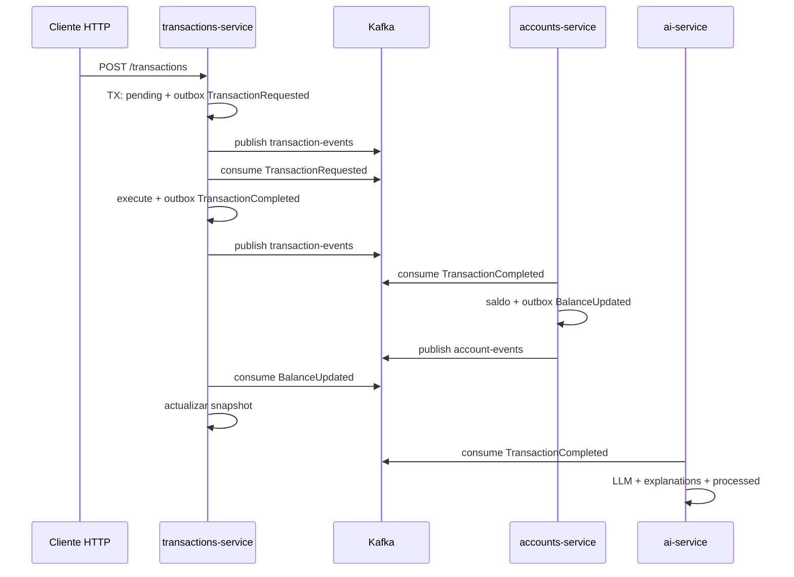

# System flow — Flujos extremo a extremo en Arkano

> Guía **visual y narrativa** de cómo recorre el sistema un caso de uso típico (alta de cuenta, depósito, transferencia, explicación AI), enlazando **HTTP, outbox, Kafka, idempotencia** y **bases de datos** con referencias al código.
>
> **Documentos relacionados:** [Microservices](./6.%20Microservices%20design.md), [Outbox](./4.%20Outbox%20Pattern.md), [Event design](./7.%20Event%20design.md), [Idempotencia](./3.Idempotencia.md), [system-overview](../../system-overview.md).

---

## Tabla de contenidos

1. [Actores y almacenes](#1-actores-y-almacenes)
2. [Flujo A: crear cliente y cuenta](#2-flujo-a-crear-cliente-y-cuenta)
3. [Flujo B: solicitar y ejecutar un depósito](#3-flujo-b-solicitar-y-ejecutar-un-depósito)
4. [Flujo C: transferencia (dos TransactionCompleted)](#4-flujo-c-transferencia-dos-transactioncompleted)
5. [Flujo D: ai-service (explicación + retry/DLQ)](#5-flujo-d-ai-service-explicación--retrydlq)
6. [Diagrama resumen (Mermaid)](#6-diagrama-resumen-mermaid)
7. [Referencias de código por paso](#7-referencias-de-código-por-paso)

---

## 1. Actores y almacenes

- **Cliente HTTP** (Postman, curl, guía en [guia-endpoints](../../05-test/guia-endpoints-paso-a-paso.md)).
- **accounts-service:** Postgres `accounts_db` (nombres típicos en compose); publica `account-events`.
- **transactions-service:** Postgres propio; publica y consume topics; mantiene `account_snapshots` y `transactions`.
- **ai-service:** Postgres propio; consume `transaction-events`; tabla `transaction_explanations` + `processed_events`.
- **Kafka:** topics `account-events`, `transaction-events`, `transaction-events-dlq`.

---

## 2. Flujo A: crear cliente y cuenta

1. `POST /clients` → `CreateClientHandler` persiste cliente (y evento de cliente si aplica según implementación).
2. `POST /accounts` → `CreateAccountHandler` en **transacción** guarda cuenta y **outbox** `AccountCreated` ([Outbox §4.1](./4.%20Outbox%20Pattern.md#41-alta-de-cuenta-accountcreated)).
3. `OutboxPublisherService` envía a `account-events`.
4. **transactions-service** (`AccountEventsConsumer` + `AccountEventApplierService`) actualiza **snapshots** e idempotencia por `eventId` ([Idempotencia §7](./3.Idempotencia.md#7-caso-3-transactions-service--snapshots-accounteventapplierservice)).

---

## 3. Flujo B: solicitar y ejecutar un depósito

1. `POST /transactions` (tipo `deposit`) → `RequestTransactionHandler` crea fila `transactions` en `pending` y outbox `TransactionRequested` ([Outbox §4.2](./4.%20Outbox%20Pattern.md#42-solicitud-de-transacción-transactionrequested)).
2. Publicación a `transaction-events`.
3. **transactions-service** consume `TransactionRequested` → `TransactionExecuteService` valida snapshot, completa transacción, encola `TransactionCompleted` ([Outbox §4.3](./4.%20Outbox%20Pattern.md#43-ejecución-de-transacción-transactioncompleted)).
4. **accounts-service** consume `TransactionCompleted` → `TransactionCompletedApplierService` actualiza saldo, `applied_transaction_legs`, outbox `BalanceUpdated`, `processed_events` ([Idempotencia §6](./3.Idempotencia.md#6-caso-2-accounts-service--doble-capa-eventid--patas-aplicadas)).
5. Publicación `BalanceUpdated` en `account-events`.
6. **transactions-service** aplica `BalanceUpdated` al snapshot (misma línea idempotente por `eventId`).

---

## 4. Flujo C: transferencia (dos TransactionCompleted)

Para `transfer`, `TransactionExecuteService` llama **dos veces** a `enqueueCompleted` (origen con monto negativo, destino positivo):

```168:178:services/transactions-service/src/infrastructure/kafka/transaction-execute.service.ts
        await this.enqueueCompleted(
          outboxRepo,
          transactionId,
          sourceAccountId,
          -amt,
        );
        await this.enqueueCompleted(
          outboxRepo,
          transactionId,
          targetAccountId,
          amt,
        );
```

Cada llamada genera un **nuevo** `eventId` en el envelope. **accounts** aplica cada mensaje de forma idempotente por **pata** `(transactionId, accountId)`.

---

## 5. Flujo D: ai-service (explicación + retry/DLQ)

1. Consume `TransactionCompleted` / `TransactionRejected` desde `transaction-events`.
2. Si `eventId` ∉ `processed_events`, entra al bucle de hasta **3** intentos ([Retry + DLQ](./5.%20Manejo%20de%20errores%20%28Retry%20%2B%20DLQ%29.md)).
3. `AiTransactionEventApplierService` llama al orquestador LLM y en **una transacción** guarda explicación + `processed_events` ([Idempotencia §8](./3.Idempotencia.md#8-caso-4-ai-service--consumidor--applier--restricción-única)).
4. Si falla todo: `sendDlq` + `processed.save` ([Idempotencia §9](./3.Idempotencia.md#9-caso-límite-dlq-en-ai-service-sin-fila-de-explicación)).

---

## 6. Diagrama resumen (Mermaid)



---

## 7. Referencias de código por paso

| Paso | Archivo / componente |
|------|----------------------|
| Solicitud transacción | `request-transaction.handler.ts` |
| Publicador outbox | `outbox-publisher.service.ts` (accounts / transactions) |
| Ejecutar requested | `transaction-execute.service.ts` |
| Aplicar completado en cuentas | `transaction-completed-applier.service.ts` |
| Snapshots | `account-event-applier.service.ts` |
| AI consumidor | `transaction-events.consumer.ts` |
| AI applier | `ai-transaction-event-applier.service.ts` |

---

*Contratos de mensajes:* [7. Event design](./7.%20Event%20design.md) y [event-contracts.md](../../03-event-driven/event-contracts.md).
