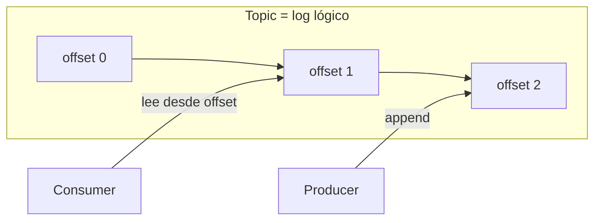
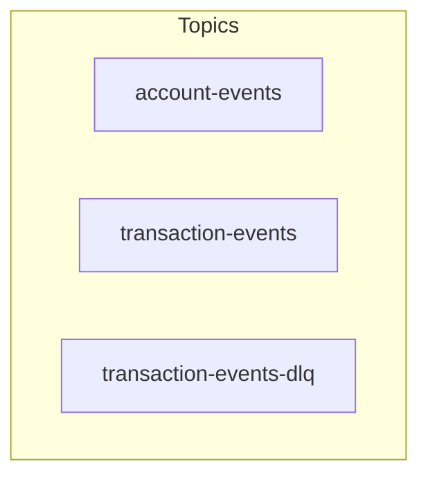
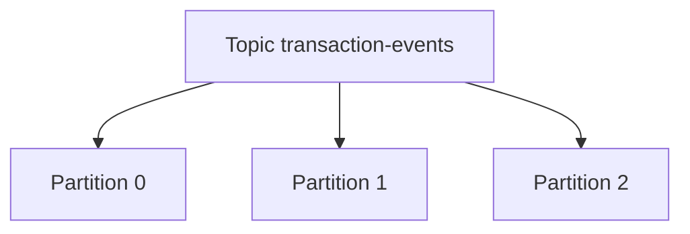
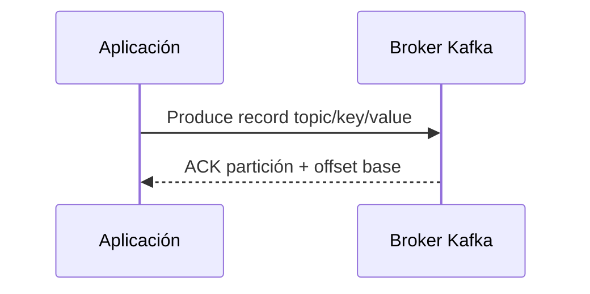
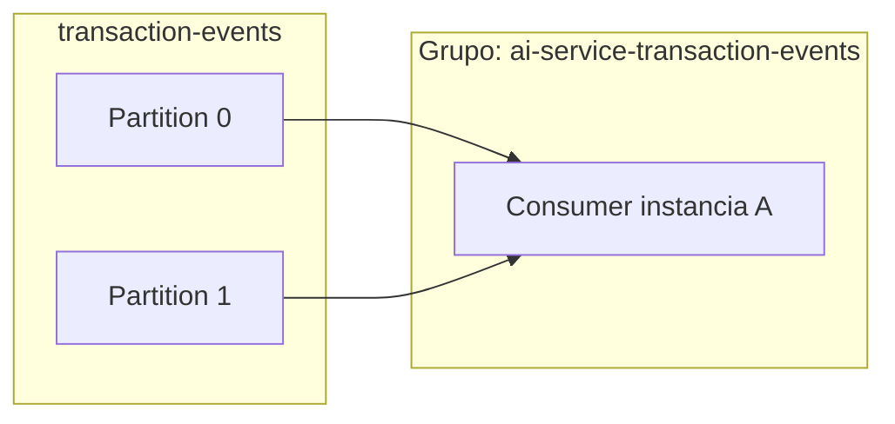
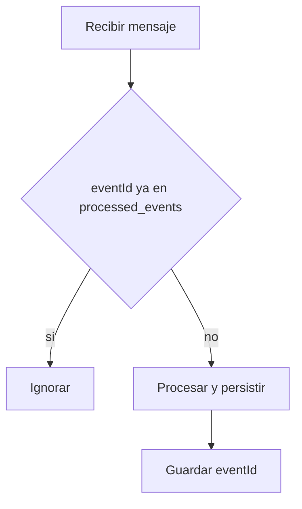

# Apache Kafka — Fundamentos teóricos desde cero

> Guía **exhaustiva y progresiva** para quien **nunca ha usado Kafka**. No asume conocimientos previos de brokers, particiones ni grupos de consumo. Al final enlaza con el **proyecto Arkano** (NestJS, Redpanda/Kafka compatible, KafkaJS).
>
> **Documento hermano:** [Event-Driven Architecture (EDA)](./1.%20Event-Driven%20Architecture%20(EDA).md) — el *por qué* de los eventos; este documento es el *cómo* del **log distribuido** que los transporta.

---

## Tabla de contenidos

1. [Qué es Kafka y qué problema resuelve](#1-qué-es-kafka-y-qué-problema-resuelve)
2. [Kafka no es “solo una cola de mensajes”](#2-kafka-no-es-solo-una-cola-de-mensajes)
3. [Idea central: el log distribuido append-only](#3-idea-central-el-log-distribuido-append-only)
4. [Componentes del ecosistema](#4-componentes-del-ecosistema)
5. [Topics: categorías de eventos](#5-topics-categorías-de-eventos)
6. [Particiones: paralelismo y orden](#6-particiones-paralelismo-y-orden)
7. [Claves (keys) y particionado](#7-claves-keys-y-particionado)
8. [Offsets: posición en el log](#8-offsets-posición-en-el-log)
9. [Productores (producers)](#9-productores-producers)
10. [Consumidores (consumers)](#10-consumidores-consumers)
11. [Grupos de consumo (consumer groups)](#11-grupos-de-consumo-consumer-groups)
12. [Rebalanceo y asignación de particiones](#12-rebalanceo-y-asignación-de-particiones)
13. [Comprometer offsets y reentregas](#13-comprometer-offsets-y-reentregas)
14. [Garantías de entrega](#14-garantías-de-entrega)
15. [Retención, tamaño y políticas del log](#15-retención-tamaño-y-políticas-del-log)
16. [Fiabilidad: duplicados, fallos y mensajes “perdidos”](#16-fiabilidad-duplicados-fallos-y-mensajes-perdidos)
17. [Patrones habituales con Kafka](#17-patrones-habituales-con-kafka)
18. [Ecosistema breve (Connect, Streams)](#18-ecosistema-breve-connect-streams)
19. [Kafka en este repositorio (Arkano)](#19-kafka-en-este-repositorio-arkano)
20. [Glosario](#20-glosario)
21. [Preguntas de repaso](#21-preguntas-de-repaso)
22. [Referencias](#22-referencias)

---

## 1. Qué es Kafka y qué problema resuelve

**Apache Kafka** es una **plataforma de streaming de eventos** distribuida. En la práctica se usa como **cola de publicación/suscripción duradera**: muchos productores escriben **registros** ordenados en **topics**; muchos consumidores los leen a su ritmo, con posibilidad de **releer** el historial según la configuración de retención.

Sirve para:

- **Desacoplar** microservicios (no hace falta que el emisor conozca a todos los receptores).
- **Absorber picos** de tráfico (los consumidores van a su velocidad mientras el log retiene datos).
- **Auditoría y reprocesamiento** (el log es la fuente de verdad temporal de lo publicado).
- **Integración** entre sistemas heterogéneos con un contrato basado en **eventos**.

En arquitectura orientada a eventos, Kafka suele ser el **bus de mensajes** o **backbone** por el que circulan los hechos de negocio (`AccountCreated`, `TransactionCompleted`, etc.).

---

## 2. Kafka no es “solo una cola de mensajes”

| Aspecto | Cola clásica (p. ej. AMQP) | Kafka (modelo de log) |
|--------|----------------------------|-------------------------|
| Modelo mental | Mensaje entregado y a menudo **eliminado** tras consumo | **Append** a un log; consumir **no borra** el dato del topic (la retención lo gobierna) |
| Orden global | A veces una cola = orden total | Orden **fuerte solo dentro de una partición** |
| Relectura | Limitada o no prevista | Diseño normal: **mismo topic**, otro consumidor u otro grupo |
| Escala | Escalar consumo con varias colas o sharding explícito | Escala horizontal con **particiones** y **grupos de consumo** |

Kafka tampoco es una **base de datos transaccional** para consultas ad hoc: no sustituye a PostgreSQL. Es un **log inmutable** optimizado para **escritura secuencial y lectura por rangos de offsets**.

---

## 3. Idea central: el log distribuido append-only

Imagina un **archivo de texto** donde solo se **añaden** líneas al final. Cada línea es un **registro** (evento). Ese archivo está **replicado** en varias máquinas (**brokers**) para tolerar fallos.

Propiedades importantes:

- **Inmutabilidad** de lo ya escrito (no se “actualiza” un mensaje antiguo; publicas uno nuevo).
- **Orden** dentro de una **partición** (ver sección 6).
- **Duración** configurable (**retención**): pasado ese tiempo o tamaño, los datos antiguos pueden eliminarse.

---

## 4. Componentes del ecosistema

### 4.1 Broker

Servidor que forma parte del **clúster** de Kafka. Almacena fragmentos de topics (**particiones**) y atiende peticiones de productores y consumidores. En producción hay **varios brokers** y la carga se reparte.

### 4.2 Clúster

Conjunto de brokers que cooperan. Un topic se divide en particiones; cada partición tiene un **líder** (broker que recibe escrituras/lecturas principales) y **réplicas** en otros brokers para alta disponibilidad.

### 4.3 Coordinación (ZooKeeper vs KRaft)

Versiones antiguas usaban **Apache ZooKeeper** para metadatos del clúster. Las versiones modernas migran a **KRaft** (Kafka Raft): Kafka gestiona su propia metadata. Para aprender conceptos de cliente (topic, partición, consumer group) **no necesitas dominar KRaft** al inicio.

### 4.4 Cliente productor y cliente consumidor

Aplicaciones que usan la **API de Kafka** (oficial Java, o librerías como **KafkaJS** en Node.js) para publicar y suscribirse. En NestJS no es obligatorio usar `@nestjs/microservices`; muchos proyectos usan **KafkaJS** directamente (como en Arkano).

---

## 5. Topics: categorías de eventos

Un **topic** es un **nombre lógico** de stream, p. ej. `transaction-events`. Todos los mensajes relacionados con “eventos de transacción” van ahí (solicitudes, completados, rechazos, etc., según diseño).

- Los **consumidores** se **suscriben** por nombre de topic.
- Un clúster puede tener **muchos topics** (dominios distintos, distintos SLAs de retención).

En Arkano aparecen, entre otros, `account-events`, `transaction-events` y `transaction-events-dlq` (dead letter).

---

## 6. Particiones: paralelismo y orden

Un topic se divide en **N particiones** (p. ej. 3). Cada partición es un **log ordenado** independiente.

**Reglas clave:**

- **Orden total** del topic **no** está garantizado entre particiones.
- **Orden** sí está garantizado **dentro de una misma partición** (por offset creciente).
- Más particiones → más **paralelismo** de lectura (más consumidores en el mismo grupo pueden trabajar en paralelo, hasta una partición por consumidor como máximo útil por asignación).

Por eso, si necesitas que todos los eventos de **una misma entidad** (p. ej. una cuenta) mantengan orden estricto de procesamiento, sueles hacer que compartan **misma clave** → misma partición (ver siguiente sección).

---

## 7. Claves (keys) y particionado

Al publicar, el productor puede enviar:

- **Key** (opcional): cadena o bytes.
- **Value** (cuerpo del mensaje): p. ej. JSON del evento.

El **particionador** del productor decide **en qué partición** cae el mensaje. Por defecto, **misma key → misma partición** (salvo que cambies el número de particiones del topic, tema avanzado).

Ejemplo de negocio: key = `accountId` garantiza que todos los eventos de esa cuenta van a la misma partición → **orden por cuenta**.

Si **no** hay key, los mensajes suelen repartirse **round-robin** entre particiones (mejor balanceo de carga, sin orden global entre cuentas).

---

## 8. Offsets: posición en el log

Cada mensaje en una partición tiene un **offset** entero creciente: 0, 1, 2, …

El consumidor, conceptualmente, dice: *“He procesado hasta el offset **k**”*. Eso es el **commit de offset** (explícito o automático según configuración).

- **Leer desde offset antiguo** = releer historia (si aún existe por retención).
- **Saltar al final** = solo mensajes nuevos (típico en consumidores con `auto.offset.reset=latest` en nuevos grupos).

En **KafkaJS**, opciones como `fromBeginning: true/false` al suscribir influyen en el comportamiento cuando el grupo **no tiene offsets comprometidos** (equivalente conceptual al “desde el principio” vs “desde lo último”).

---

## 9. Productores (producers)

Responsabilidades típicas:

1. Serializar el **valor** (JSON, Avro, etc.).
2. Elegir **topic**, **key** opcional y **headers** opcionales (metadatos).
3. Enviar y esperar **acknowledgement** del broker según configuración (`acks`).

Conceptos útiles:

- **Compresión**: reduce ancho de banda (`gzip`, `lz4`, etc.).
- **Idempotencia del producer** (Kafka Java, configuración avanzada): reduce duplicados por reintentos del lado del productor; **no** sustituye la idempotencia del **consumidor**.

En Arkano, la publicación al broker suele hacerse desde un **outbox** (misma transacción que la BD de negocio + fila pendiente; un worker envía a Kafka). Ver [patrón outbox](../../03-event-driven/outbox-pattern.md).

---

## 10. Consumidores (consumers)

Un consumidor:

1. Se **suscribe** a uno o más topics.
2. Recibe **lotes** o mensajes uno a uno (según API).
3. **Procesa** el mensaje (lógica de negocio, escritura en BD, etc.).
4. **Compromete** el offset si el procesamiento fue correcto (según política).

Si el proceso falla **antes** de comprometer, el mensaje puede **reentregarse** (at-least-once).

---

## 11. Grupos de consumo (consumer groups)

Varios consumidores pueden compartir el mismo **`group.id`**:

- Kafka **reparte particiones** entre los miembros del grupo.
- **Cada partición** del topic se asigna como máximo a **un** consumidor del grupo a la vez.
- El **mismo mensaje** no se procesa en paralelo por dos instancias del **mismo grupo** (evita duplicar trabajo dentro del grupo).

Si quieres **varias aplicaciones** leyendo el **mismo stream** con propósitos distintos (p. ej. analytics vs servicio de negocio), usan **grupos distintos**: cada grupo avanza su propio offset.

Con **dos instancias** del mismo servicio y el mismo `group.id`, cada una recibiría particiones distintas (rebalanceo).

---

## 12. Rebalanceo y asignación de particiones

Cuando un consumidor **entra o sale** del grupo, o el coordinador detecta fallo, ocurre un **rebalanceo**:

- Se **revocan** asignaciones.
- Se **reasignan** particiones.

Durante el rebalanceo puede haber **latencia** y mensajes de log del estilo *“re-joining the group”*. Es normal en desarrollo local con Redpanda/Kafka al arrancar servicios.

---

## 13. Comprometer offsets y reentregas

- **Commit automático**: el cliente confía en un temporizador; más simple, riesgo de perder mensaje si crasheas justo después de procesar pero antes de commit (o duplicar en el caso inverso, según orden).
- **Commit manual / tras procesar**: patrón habitual en sistemas críticos: **procesar + persistir efectos + commit**.

Si no comprometes y el consumidor cae, **otro** miembro del grupo puede **releer** desde el último offset comprometido → **reentrega**.

---

## 14. Garantías de entrega

| Modo | Idea | Duplicados | Pérdidas |
|------|------|------------|----------|
| **At-most-once** | Commit antes de procesar | No (en condiciones normales) | Posible si fallas tras commit y antes de terminar el trabajo |
| **At-least-once** | Procesar y luego commit (o commit con cuidado) | **Posibles** si hay reentrega | Menos probables si diseño correcto |
| **Exactly-once** | Semántica fuerte extremo-a-extremo | Teóricamente no | Muy complejo (transacciones Kafka, EOS con streams, etc.) |

La mayoría de microservicios con Kafka usan **at-least-once** en el transporte y **idempotencia** en el consumidor (`processed_events`, claves naturales, etc.).

---

## 15. Retención, tamaño y políticas del log

- **Tiempo** (`retention.ms`): cuánto se conservan mensajes.
- **Tamaño** (`retention.bytes`): límite por partición.
- **Compactación** (topics compacted): para topics tipo “último valor por key” (changelog), distinto del modelo de eventos de dominio puro que suele ser **append + retención por tiempo**.

Si la retención es corta y un consumidor estuvo caído mucho tiempo, puede **perder** mensajes antiguos (ya no existen en el broker).

---

## 16. Fiabilidad: duplicados, fallos y mensajes “perdidos”

**Duplicados:** normales con at-least-once. Solución: **idempotencia** (tabla de `event_id` procesados, claves de negocio únicas, etc.).

**Pérdida aparente en desarrollo:**

- Consumidor nuevo con política **solo desde el final** del log mientras publicaste eventos **antes** de que estuviera listo → no los ve. En Arkano se documentó `KAFKA_CONSUMER_FROM_BEGINNING` en ai-service para entornos locales.

**Broker caído:** con réplicas y `acks` adecuados, el clúster puede seguir sirviendo; en local con un solo broker, si cae Docker, todo el streaming se detiene hasta recuperar el broker.

---

## 17. Patrones habituales con Kafka

### 17.1 Idempotencia en el consumidor

Antes de aplicar efectos secundarios (BD, dinero, etc.), comprobar si el `eventId` (o correlación) ya fue procesado.

### 17.2 Outbox

Escribir evento en la **misma transacción** que los datos de negocio; un publicador asíncrono envía a Kafka. Evita “BD ok, Kafka falló” sin registro recuperable.

### 17.3 Dead Letter Queue (DLQ)

Tras **N reintentos**, mover el mensaje a un **topic de error** para inspección manual o reproceso, sin bloquear el topic principal indefinidamente.

### 17.4 Saga / coreografía

Varios pasos de negocio publican eventos encadenados; no hay orquestador central obligatorio. Kafka transporta cada paso.

---

## 18. Ecosistema breve (Connect, Streams)

- **Kafka Connect**: integración con bases de datos, S3, etc. mediante *source/sink connectors*.
- **Kafka Streams / ksqlDB**: procesamiento **stateful** sobre topics (agregaciones, joins de streams). No son necesarios para el patrón básico “publicar / consumir” de microservicios.

Para el challenge Arkano, basta **productor + consumidor + topics + particiones + grupos**.

---

## 19. Kafka en este repositorio (Arkano)

| Elemento | Uso en el proyecto |
|----------|-------------------|
| **Broker local** | **Redpanda** en Docker (API compatible con Kafka, puerto típico `19092` desde el host) |
| **Cliente Node** | **KafkaJS** en los tres microservicios NestJS |
| **Topics** | `account-events`, `transaction-events`, `transaction-events-dlq` |
| **Publicación** | Patrón **outbox** + `OutboxPublisherService` que hace flush periódico |
| **Consumo** | Consumidores dedicados por tipo de evento (`TransactionRequested` vs `TransactionCompleted`, etc.) |
| **Idempotencia** | Tablas `processed_events` y reglas de dominio (p. ej. patas aplicadas) |
| **Logs de trazabilidad** | Prefijo `[EVENT-BUS]` en consola para ver **PUBLISH** / **CONSUME** / **SKIP** / **EXEC** / **DONE** |

Documentación de contratos e idempotencia: carpeta [`docs/03-event-driven`](../../03-event-driven/).

---

## 20. Glosario

| Término | Definición corta |
|---------|------------------|
| **Broker** | Nodo del clúster que almacena y sirve datos de topics |
| **Topic** | Nombre de un stream de registros |
| **Partición** | Fragmento ordenado de un topic |
| **Offset** | Índice secuencial del mensaje dentro de la partición |
| **Producer** | Cliente que escribe en topics |
| **Consumer** | Cliente que lee de topics |
| **Consumer group** | Conjunto de consumidores que comparten carga y un mismo cursor lógico por partición |
| **Commit** | Registrar hasta qué offset se considera procesado |
| **Rebalanceo** | Reasignación de particiones entre miembros del grupo |
| **DLQ** | Topic para mensajes que fallaron tras reintentos |
| **Outbox** | Tabla transaccional de eventos pendientes de publicar a Kafka |

---

## 21. Preguntas de repaso

1. ¿En qué se diferencia un **topic** de una **partición**?
2. ¿Dónde se garantiza el **orden** de los mensajes?
3. ¿Para qué sirve la **key** del mensaje?
4. ¿Qué es un **consumer group** y qué pasa si añades más instancias con el mismo `group.id`?
5. ¿Por qué at-least-once implica pensar en **idempotencia**?
6. ¿Qué problema resuelve el patrón **outbox**?
7. ¿Cuándo tendría sentido un topic **DLQ**?

---

## 22. Referencias

- Documentación oficial: [https://kafka.apache.org/documentation/](https://kafka.apache.org/documentation/)
- KafkaJS (Node.js): [https://kafka.js.org/](https://kafka.js.org/)
- En este repo: [EDA — guía desde cero](./1.%20Event-Driven%20Architecture%20(EDA).md), [Outbox](../../03-event-driven/outbox-pattern.md), [Idempotencia](../../03-event-driven/idempotency-strategy.md), [Guía endpoints y bus](../../05-test/guia-endpoints-paso-a-paso.md)

---

*Documento reescrito como fundamento teórico desde cero; alinear con la versión de Kafka/Redpanda que uses en producción para detalles de configuración finos (`acks`, ISR, etc.).*
